# Customer Segmentation, LTV & Profit Optimization

## 1. Stop Buying Revenue, Start Growing Profitable Loyalty

Luận điểm chính của report này là: doanh nghiệp không nên tối ưu theo `Revenue` một cách đơn độc. Trong bối cảnh e-commerce fashion, `Revenue` có thể tăng nhờ promotion, nhưng nếu promotion làm giảm `Gross Margin`, kéo theo `Refund`, `Return Quantity`, `Shipping Cost`, hoặc chỉ thu hút nhóm khách hàng mua một lần, thì doanh nghiệp đang “mua revenue” thay vì xây dựng `Profitable Loyalty`.

Vì vậy, câu chuyện mà tôi đề ra sau đây là xây dựng một **Profit-Secured Loyalty Engine**. Engine này trả lời bốn câu hỏi theo đúng rubric của đề thi.

- Thứ nhất, chuyện gì đang xảy ra với profit và customer base?
- Thứ hai, vì sao profit bị tập trung hoặc bị rò rỉ?
- Thứ ba, customer nào có khả năng trở thành loyal từ rất sớm?
- Và cuối cùng, doanh nghiệp nên phân bổ lại marketing, promotion, product, inventory và user experience như thế nào để tăng `LTV` thay vì chỉ tăng `Revenue`.

## 2. Data Foundation và cách định nghĩa Customer Value

Phân tích này bắt đầu từ `Customer Golden Table`, trong đó mỗi dòng là một `customer_id`. Bảng được tạo bằng cách nối `orders`, `order_items`, `products`, `customers`, `promotions`, `reviews`, `returns` và các bảng liên quan. Các metric cốt lõi gồm `Recency`, `Frequency`, `Monetary Revenue`, `Monetary Profit`, `AOV`, `Promo Usage Rate`, `Average Rating`, `Refund Rate`, `Return Quantity`, `Purchase Lifespan`, `Preferred Category`, `Acquisition Channel`, và các thông tin nhân khẩu học.

Điểm quan trọng nhất là `Monetary` trong segmentation không nên dùng `Revenue` mà nên dùng `Profit`. Với một doanh nghiệp fashion e-commerce, hai khách hàng có cùng revenue có thể tạo ra giá trị hoàn toàn khác nhau nếu một người mua full price, ít return, ít refund, còn người kia chỉ mua khi có deep discount và thường xuyên trả hàng. Vì thế, `LTV` trong report này được nhìn dưới góc độ thực dụng: **customer có giá trị cao không chỉ là người mua nhiều, mà là người tạo ra profit bền vững, ít phụ thuộc promotion, ít gây leakage qua refund/return, và có dấu hiệu quay lại.**

Segment cuối cùng được xây dựng từ hai lớp. Lớp đầu là `Rule-based RFM Segmentation`, giúp đặt tên hành vi dễ hiểu như `Champions`, `Loyal`, `Potential`, `Need Attention`, `At Risk`, `Lost`. Lớp thứ hai là `Objective Score`, được tính theo profit, frequency, retention health, margin, lifespan, satisfaction, review engagement, promo dependency, refund, refund rate và return quantity. Sau đó, `RFM tier` và `Objective Score tier` được kết hợp thành một `Final Segment`. Cách làm này giữ được tính explainable của RFM, nhưng vẫn đưa business objective vào segmentation để tránh tình trạng label đẹp nhưng không tối ưu profit.

## 3. The Profit Problem: Profit không phân bổ đều trong customer base

Trước khi hỏi "nên chăm sóc customer nào", cần chứng minh rằng customer base không đồng nhất. Phân tích `Lorenz Curve` cho thấy profit tập trung rất mạnh trong một nhóm nhỏ customer. Trong 89,988 customers đã có realized purchase, tổng `Revenue` đạt khoảng 16.24 tỷ và tổng `Profit` đạt khoảng 2.24 tỷ. **Tuy nhiên, top 20% customers tạo ra khoảng 66.5% total profit, top 10% tạo ra khoảng 44.5%, và top 5% tạo ra khoảng 28.0%.**

Điều này có ý nghĩa rất lớn về mặt business. Nếu doanh nghiệp dùng cùng một mức ưu đãi, cùng một chiến dịch email, cùng một chính sách chăm sóc cho toàn bộ customer base, thì ngân sách marketing đang bị dàn trải sang cả những nhóm không tạo ra nhiều profit. Ngược lại, nếu doanh nghiệp chỉ tối ưu acquisition volume mà không phân biệt quality của customer, tăng trưởng customer count có thể không chuyển hóa thành tăng trưởng profit.

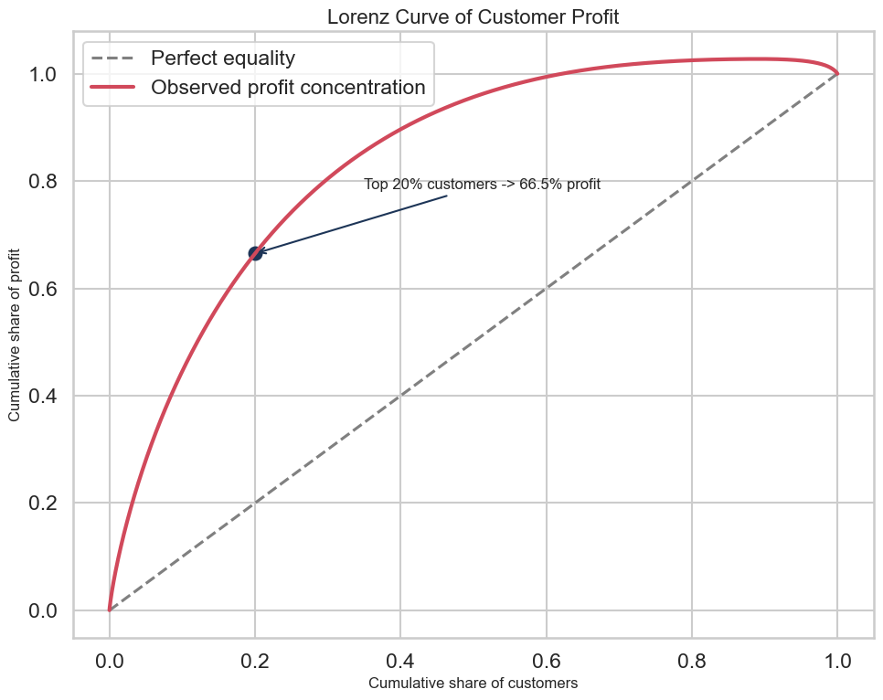

Ở đây có một chi tiết đáng chú ý: có 9,722 customers có `Monetary Profit` âm, tương đương 10.8% trong 89,988 customers đã có realized purchase. Tổng phần profit âm của nhóm này khoảng -61.7 triệu, trong khi 80,266 customers còn lại là nhóm không âm. Đây không chỉ là outlier thống kê. Về business, nhóm này đại diện cho những trường hợp doanh nghiệp đã phục vụ customer nhưng không thu được profit sau khi tính giá vốn và các yếu tố liên quan. Nếu tiếp tục dùng promotion để kéo nhóm này quay lại mà không có điều kiện margin, doanh nghiệp có thể đang mở rộng một customer base không kinh tế.

Vì vậy, insight đầu tiên không phải là "top customers quan trọng", vì điều này khá hiển nhiên. Insight sâu hơn là: **growth strategy hiện tại cần được kiểm soát bằng profit quality**. Doanh nghiệp không nên hỏi "làm sao có thêm nhiều customers", **mà nên hỏi "làm sao có thêm customers giống nhóm tạo profit bền vững, và làm sao giảm leakage từ nhóm mua nhiều nhưng margin thấp".**

## 4. Six Final Segments: Customer nào thật sự đáng đầu tư?

Sau khi kết hợp `RFM` với `Objective Score`, customer base được chia thành sáu segment: `Champions`, `Loyal`, `Potential`, `Need Attention`, `At Risk`, và `Lost`. Sáu label này đủ đơn giản để business team sử dụng, nhưng vẫn đủ giàu thông tin để gắn với chiến lược marketing, promotion, product và user experience.

Kết quả segment cho thấy sự chênh lệch rất rõ. `Champions` chiếm 25.3% customers nhưng tạo ra 70.8% total profit. `Loyal` chiếm 13.9% customers và tạo thêm 13.9% profit. Nói cách khác, hai nhóm đầu chiếm khoảng 39.2% customer base nhưng tạo ra gần 84.7% profit. Ngược lại, `Lost` chiếm 21.1% customers nhưng chỉ tạo 2.0% profit.

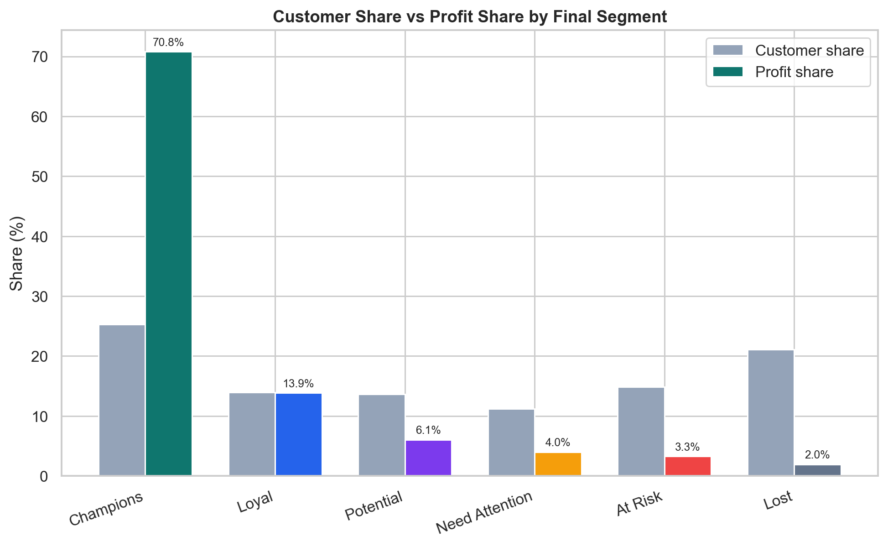

| Segment        | Customer Share | Profit Share | Avg Profit | Avg Frequency | Avg Recency Days | Avg Margin | Promo Usage |
| -------------- | -------------: | -----------: | ---------: | ------------: | ---------------: | ---------: | ----------: |
| Champions      |          25.3% |        70.8% |     69,719 |         17.65 |              335 |      16.0% |       36.1% |
| Loyal          |          13.9% |        13.9% |     24,795 |          7.61 |              686 |      15.8% |       33.5% |
| Potential      |          13.6% |         6.1% |     11,103 |          4.39 |              733 |      13.9% |       35.3% |
| Need Attention |          11.2% |         4.0% |      8,935 |          3.25 |            1,242 |      13.0% |       36.3% |
| At Risk        |          14.9% |         3.3% |      5,511 |          2.38 |            1,834 |      13.0% |       37.9% |
| Lost           |          21.1% |         2.0% |      2,304 |          1.27 |            2,698 |       9.2% |       47.2% |

Bảng này là bằng chứng mạnh cho một quyết định chiến lược: doanh nghiệp cần chuyển từ `one-size-fits-all marketing` sang `segment-based investment`. `Champions` không cần deep discount để mua lại; họ cần được giữ chân bằng loyalty benefit, early access, personalized service và product relevance. `Potential` cần nurturing để tăng frequency nhưng phải kiểm soát margin. `At Risk` và `Lost` không nên nhận cùng mức ngân sách cá nhân hóa như `Champions`, vì xác suất tạo profit thấp hơn nhiều.

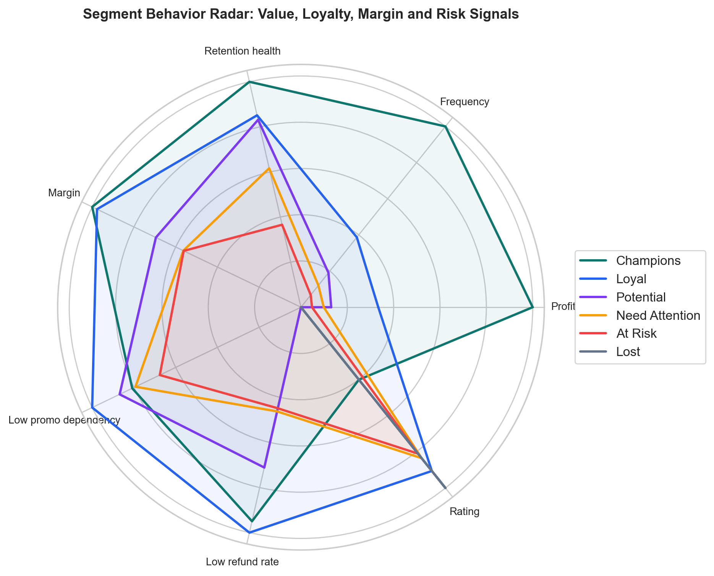

Radar plot cho thấy `Champions` nổi bật trên gần như mọi chiều: profit, frequency, retention health, margin, refund risk thấp và rating ổn định. Trong khi đó, `Lost` không chỉ có frequency thấp và recency xấu, mà còn có promo dependency cao hơn và margin thấp hơn. Đây là lý do report nên tránh mô tả `Lost` đơn giản là "khách lâu chưa mua". Business meaning chính xác hơn là: `Lost` là nhóm vừa ít tương tác, vừa ít profit, vừa dễ bị kéo bởi discount, nên cần chiến lược chi phí thấp.

**Một phát hiện thú vị là `Preferred Category` của hầu hết các segment đều nghiêng về `Streetwear`, và nhận xét này có bằng chứng khá rõ.** `Streetwear` là preferred category của 16,952 `Champions` tương đương 74.5% nhóm này, 8,586 `Loyal` tương đương 68.4%, 7,809 `Potential` tương đương 63.8%, 6,353 `Need Attention` tương đương 63.2%, 8,089 `At Risk` tương đương 60.4%, và 10,594 `Lost` tương đương 55.8%. Nếu chỉ nhìn category preference, ta có thể kết luận rằng tất cả segment đều giống nhau. Nhưng khi thêm profit, margin, promo usage, refund và recency, bức tranh khác hoàn toàn. Điều này cho thấy product preference một mình không đủ để segment customer; **cùng mua `Streetwear`, nhưng `Champions` và `Lost` tạo ra giá trị kinh tế rất khác nhau.**

## 5. Behavior Deep Dive: Segment khác nhau ở value mechanics, không chỉ ở demographics

Khi đi sâu vào behavior, các đặc điểm demographic như `Age Group`, `Gender`, hoặc `Acquisition Channel` không tạo khác biệt mạnh bằng các chỉ số value mechanics. Ví dụ, `25-34` là nhóm tuổi phổ biến nhất ở nhiều segment; `Organic Search` cũng là acquisition channel đứng đầu ở hầu hết các segment. Điều này có nghĩa là segmentation không nên dựa quá nhiều vào demographic hoặc acquisition label bề mặt.

Thay vào đó, điểm phân biệt thật sự nằm ở cách customer tạo hoặc làm mất profit. `Champions` có avg frequency 17.65, avg units 88.4 và purchase lifespan khoảng 3,252 ngày. `Lost` chỉ có frequency 1.27, units 6.3 và lifespan khoảng 151 ngày. Đây là khác biệt về relationship depth, không phải chỉ khác biệt về persona.

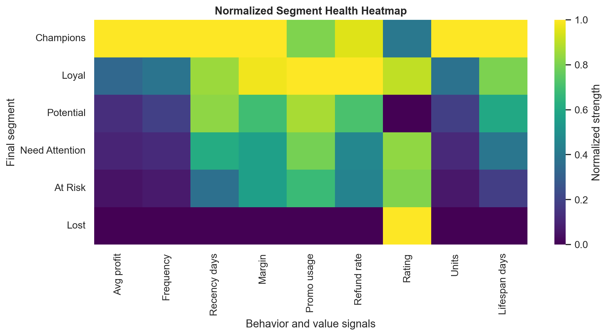

Nếu chuyển insight này thành business action, doanh nghiệp nên xây dựng CRM theo "relationship stage". Customer mới không nên lập tức bị đẩy vào discount funnel. Customer có tín hiệu giống `Champions` nên được đưa vào loyalty journey, trong khi customer có dấu hiệu discount dependency nên được giới hạn ưu đãi hoặc chuyển sang automated low-cost campaign. Nói cách khác, segment không chỉ dùng để đặt tên nhóm, mà nên trở thành logic vận hành cho CRM, promotion engine và product recommendation.

## 6. Promotion Efficiency: Promotion đang kéo revenue nhưng làm rò rỉ margin

Một trong những insight quan trọng nhất của phân tích này là promotion không luôn tạo giá trị. Khi tách margin theo segment và trạng thái có/không có promotion, sự khác biệt rất rõ. Với `Champions`, gross margin khi không dùng promotion khoảng 20.6%, nhưng khi có promotion chỉ còn 3.3%. Với `Loyal`, margin khi có promotion chỉ còn 0.7%. Với `Potential`, `Need Attention`, và `At Risk`, promotion margin thậm chí âm lần lượt khoảng -3.5%, -3.0%, và -5.6%.

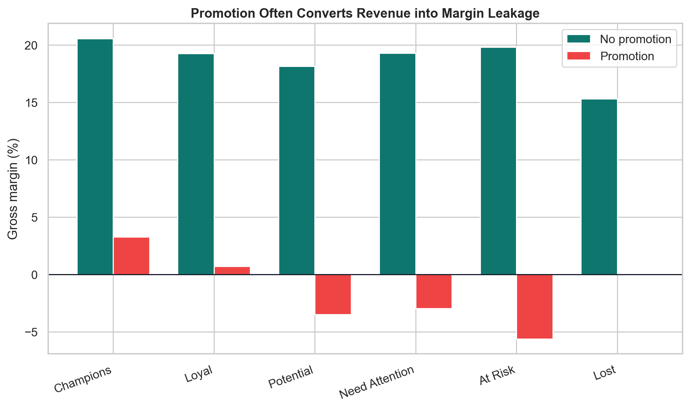

Đây là điểm business rất mạnh: **promotion có thể tăng conversion hoặc order volume, nhưng nếu margin sau promotion âm, doanh nghiệp đang trả tiền để tạo revenue.** Điều này đặc biệt nguy hiểm với các segment chưa chứng minh được long-term value. Nếu một customer thuộc `Potential` hoặc `At Risk` chỉ mua khi có discount và tạo margin âm, thì chiến dịch win-back hoặc nurture cần được thiết kế lại theo `incremental profit`, không phải theo `redemption rate`.

Ở cấp category, `Streetwear` là category có volume lớn nhất và đóng góp profit lớn, nhưng promotion margin của `Streetwear` gần như âm, khoảng -0.12%. Cụ thể, `Streetwear` bán 1,586,222 units, chiếm 55.1% total units, tạo khoảng 11.77 tỷ revenue và 1.56 tỷ profit, tương đương 76.7% category-level profit trong bảng item facts. Tuy nhiên, margin của `Streetwear` khi không có promotion là khoảng 19.7%, còn khi có promotion giảm xuống -0.12%. Đây là mâu thuẫn chiến lược: `Streetwear` là engine kéo demand, nhưng cũng là nơi discount dễ ăn mòn profit nhất. Nếu doanh nghiệp tiếp tục dùng `Streetwear` làm category chính cho promotion mà không có guardrail, tăng trưởng revenue có thể đi kèm suy giảm profit quality.

Khuyến nghị không phải là dừng promotion. **Khuyến nghị đúng hơn là xây dựng `Promotion Governance`. Với `Champions`, hạn chế deep discount và thay bằng early access, loyalty point, bundle độc quyền hoặc service benefit. Với `Potential`, chỉ dùng promotion có điều kiện margin, ví dụ minimum order value, bundle có sản phẩm margin cao, hoặc personalized offer dựa trên category preference. Với `At Risk`, win-back nên có giới hạn thời gian và chỉ triển khai cho nhóm có propensity quay lại hoặc historical margin đủ tốt. Với `Lost`, nên ưu tiên automated campaign chi phí thấp, không dùng high-touch promotion.**

## 7. UX và Churn: churn-risk segment có nhiều friction hơn

Churn không chỉ là câu chuyện customer quên brand. Một phần churn có thể đến từ `User Experience`: shipping fee cao hơn, return nhiều hơn, refund nhiều hơn, hoặc rating thấp hơn. Khi so sánh các segment ở cấp order, `Lost` có return order rate khoảng 7.9%, cao hơn `Champions` ở mức 5.8%. `Lost` cũng có average shipping fee khoảng 5.75, cao hơn `Champions` khoảng 4.83; tức cao hơn khoảng 0.92 trên mỗi order, tương đương chênh lệch tương đối khoảng 19.0%. Average rating của `Lost` là 3.87, thấp hơn `Champions` khoảng 3.95. Các segment trung gian cũng đi theo hướng hợp lý: `Potential` và `Need Attention` có return order rate khoảng 7.1%, còn `At Risk` khoảng 7.4%, đều cao hơn `Champions` và `Loyal`.

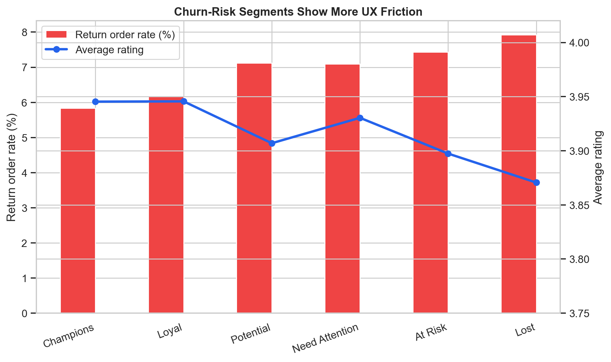

Chênh lệch rating có vẻ nhỏ, nhưng trong e-commerce, các friction nhỏ lặp lại ở quy mô lớn có thể ảnh hưởng đến repeat purchase. Một customer gặp shipping fee cao, delivery không thuận tiện hoặc phải return sản phẩm có thể không phản hồi trực tiếp, nhưng sẽ không quay lại. Điều này giải thích vì sao `Need Attention`, `At Risk`, và `Lost` không nên chỉ được xử lý bằng discount. Nếu nguyên nhân là trải nghiệm, discount chỉ che phủ triệu chứng mà không xử lý gốc rễ.

**Business implication ở đây là các chiến dịch retention nên kết hợp `Commercial Offer` với `Experience Fix`.** Ví dụ, với customer có return/refund cao, win-back email nên đi kèm cam kết size guide tốt hơn, đổi trả rõ hơn, hoặc recommendation chính xác hơn. Với customer bị shipping fee cao, nên test free-shipping threshold thay vì discount trực tiếp vào product price. Nếu doanh nghiệp giảm giá sản phẩm nhưng vẫn để shipping friction cao, campaign có thể tiếp tục kéo margin xuống mà không cải thiện loyalty.

## 8. Cohort Retention: Retention có yếu tố seasonality, không chỉ là snapshot

Segmentation là ảnh chụp tại một thời điểm, còn `Cohort Retention` cho biết doanh nghiệp giữ chân customer tốt hơn hay kém hơn theo thời gian hoặc theo mùa. Thay vì nhóm cohort theo từng tháng, report này dùng `first-purchase quarter` để pattern dễ đọc hơn và có ý nghĩa quản trị hơn. Với dữ liệu kéo dài từ 2012 đến 2022, quarter-level cohort vẫn giữ được seasonality, nhưng giảm nhiễu so với month-level cohort.

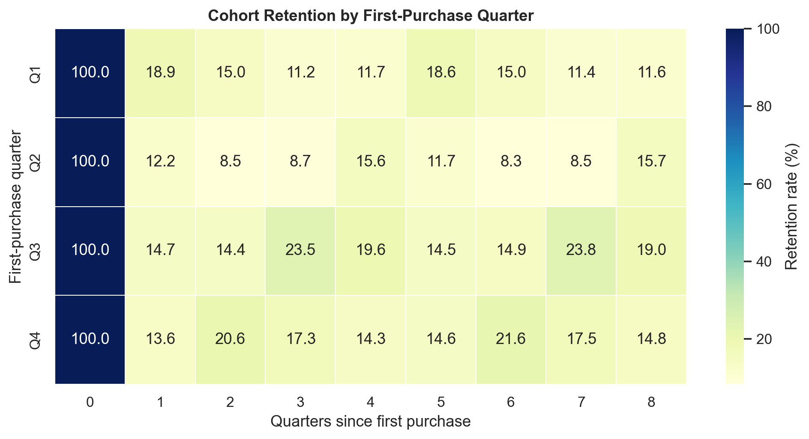

Kết quả cho thấy retention khác biệt rõ theo quarter mua lần đầu. Ở quarter đầu tiên sau first purchase, `Q1` cohort có retention khoảng 18.9%, cao nhất trong bốn nhóm, trong khi `Q2` chỉ đạt khoảng 12.2%, thấp nhất. Ở quarter thứ hai sau first purchase, khoảng cách còn rõ hơn: `Q4` cohort đạt khoảng 20.6%, trong khi `Q2` chỉ khoảng 8.5%. Nhìn xa hơn một năm, `Q3` cohort có retention quarter thứ tư khoảng 19.6%, cao hơn đáng kể so với `Q1` ở mức 11.7%.

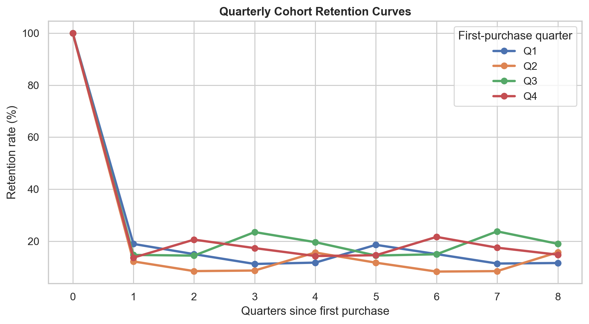

Insight chính không phải chỉ là “retention có mùa vụ”, mà là mỗi acquisition quarter có một post-purchase runway khác nhau. `Q2` là cohort đáng lo nhất vì retention yếu ngay ở giai đoạn sớm: Q+1 chỉ 12.2% và Q+2 chỉ 8.5%. Điều này gợi ý rằng customers mua lần đầu trong Q2 có thể đến từ các campaign hoặc nhu cầu mua sắm ngắn hạn hơn, nên cần onboarding và second-purchase trigger mạnh hơn ngay sau first order. Ngược lại, `Q3` và `Q4` có dấu hiệu comeback tốt hơn ở các quarter sau, có thể liên quan đến seasonality cuối năm hoặc nhu cầu mua sắm lặp lại theo chu kỳ.

Từ góc nhìn business, quarter-level cohort mở ra hai hướng hành động rõ hơn month-level cohort. Thứ nhất, doanh nghiệp nên thiết kế `Quarter-specific Retention Playbook`: Q2 customers cần post-purchase journey ngắn và quyết liệt hơn trong 30-90 ngày đầu, trong khi Q3/Q4 có thể phù hợp với seasonal replenishment, holiday campaign hoặc product drop. Thứ hai, budget acquisition không nên chỉ tối ưu theo CAC trung bình. Nếu một quarter tạo nhiều first orders nhưng retention sau một hoặc hai quarter thấp, CAC thực tế theo LTV có thể đắt hơn nhiều so với nhìn bề mặt.

## 9. Early Loyalty Propensity: Dự đoán loyalty ngay từ first order

Một phần rất quan trọng để đạt cấp độ `Predictive` trong rubric là không chỉ mô tả customer đã loyal, mà phải tìm tín hiệu sớm cho biết customer nào có khả năng trở thành loyal. Vì vậy, notebook xây dựng `Early Loyalty Propensity Modeling` với hai lớp model. Lớp đầu là `Logistic Regression`, dùng như một baseline dễ giải thích để xem hướng tác động tuyến tính của các signal. Lớp thứ hai là `XGBoost`, một tree-based model mạnh hơn để kiểm tra robustness vì nó xử lý tốt hơn non-linearity và interaction giữa features. Target là `is_loyal = 1` nếu customer cuối cùng có frequency lớn hơn 3. Feature chỉ lấy từ thông tin có thể biết tại checkout hoặc ngay sau first order: acquisition channel, first order source, device type, payment method, region/city, first basket value, profit, margin, discount rate, units, item count, first product category, product segment, price band, shipping fee, delivery days, return/refund, first review/rating, first order month, và signup-to-first-order days.

Điểm cần làm rõ là `Logistic Regression` không giả định các features độc lập theo nghĩa strict như `Naive Bayes`. Tuy nhiên, khi các features tương quan mạnh, ví dụ `first_order_value`, `first_payment_value`, `discount_rate`, `product_price_band`, coefficient của Logistic Regression có thể khó diễn giải riêng lẻ vì multicollinearity và vì model giả định quan hệ tuyến tính trên log-odds. Do đó, report không nên xem coefficient tuyến tính là bằng chứng duy nhất. `XGBoost` được thêm vào như một robustness check để bắt được interaction và non-linear split trong dữ liệu. Trên validation set, Logistic Regression đạt AUC khoảng 0.693, trong khi XGBoost đạt AUC khoảng 0.731, cho thấy tree-based model khai thác thêm được thông tin từ cấu trúc feature phức tạp hơn.

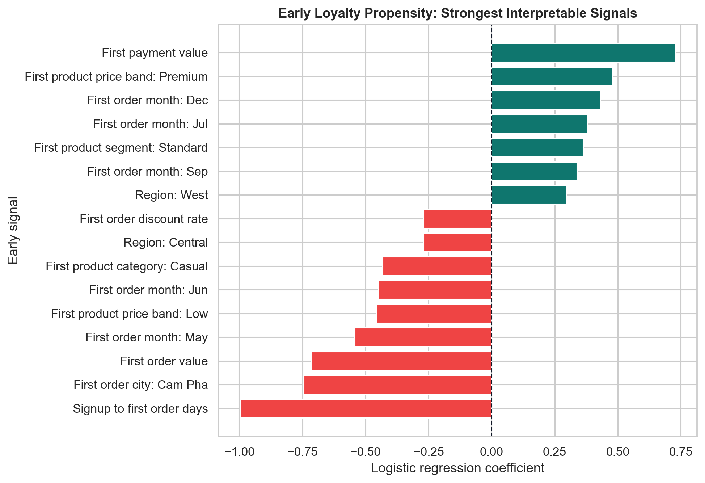

Bổ sung cho baseline tuyến tính, XGBoost feature importance cho thấy các nhóm tín hiệu early-stage quan trọng nhất không chỉ nằm ở basket value. Nhóm `Context/timing` chiếm khoảng 54.9% tổng gain importance, `Product intent` chiếm 15.0%, `First basket economics` chiếm 12.3%, `Conversion speed` chiếm 11.1%, `Acquisition/channel` chiếm 4.4%, và `Post-purchase experience` chiếm 2.1%. Top features theo gain gồm `Signup to first order days`, `First order month`, `First order city`, `Region`, `Promo on first order`, và `First product price band`. Điều này củng cố một insight quan trọng: loyalty không chỉ được dự báo bởi giá trị đơn đầu, mà còn bởi thời điểm mua, market context, product intent và mức phụ thuộc promotion ngay từ lần đầu.

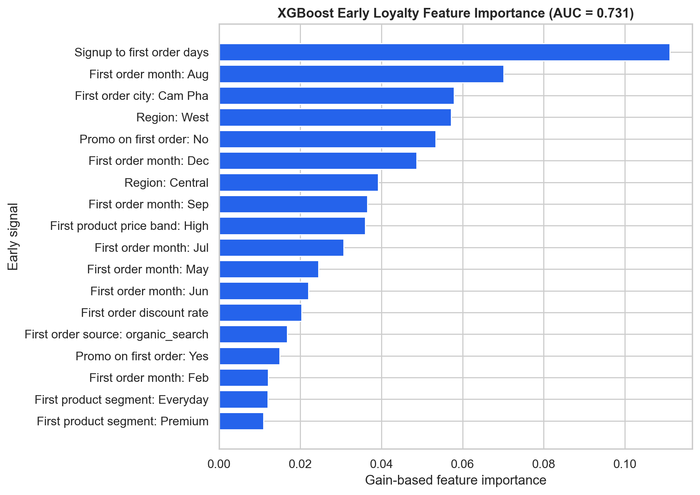

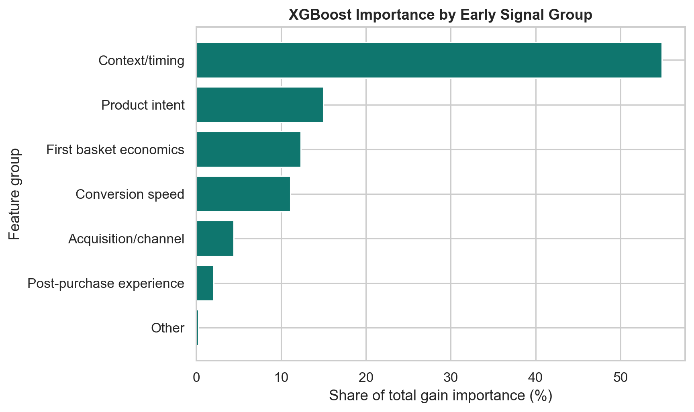

Coefficient plot cho thấy một số tín hiệu đáng chú ý. `Signup to first order days` có coefficient âm mạnh: customer mất quá lâu từ signup đến đơn hàng đầu tiên có xu hướng ít trở thành loyal hơn. `First product price band: Premium` có coefficient dương, trong khi `Low` có coefficient âm, gợi ý rằng entry product ở price tier cao hơn có thể là dấu hiệu của purchase intent nghiêm túc hơn. `First order discount rate` có coefficient âm, phù hợp với câu chuyện promotion dependency: nếu customer cần discount mạnh ngay từ lần đầu, khả năng họ trở thành loyal profitable customer có thể thấp hơn.

Một điểm cần diễn giải cẩn thận là các coefficient trong logistic regression là tác động có điều kiện khi các biến khác được giữ trong model, không phải quan hệ nhân quả tuyệt đối. Ví dụ, `First payment value` và `First order value` có thể cùng xuất hiện với dấu khác nhau do tương quan giữa payment, discount, basket structure và các biến product. Vì vậy, nên đọc model này theo nhóm tín hiệu: tốc độ chuyển đổi từ signup sang purchase, product price tier, discount dependency, seasonality và market context là những early signals đáng theo dõi.

Ứng dụng business rất rõ: **sau first order, doanh nghiệp có thể gắn `Loyalty Propensity Score` để quyết định customer journey.** Customer có propensity cao nên được đưa vào loyalty nurturing, cross-sell và personalized product recommendation. Customer có propensity thấp nhưng basket tốt có thể nhận onboarding hoặc education content. Customer có propensity thấp và discount dependency cao nên tránh nhận deep discount lặp lại, vì khả năng tạo LTV profit thấp.

## 10. Recommended Operating Model

Từ toàn bộ phân tích, chiến lược đề xuất không phải là một campaign đơn lẻ mà là một operating model. Mỗi segment cần một vai trò trong profit engine.

| Segment        | Business Meaning                                                  | Main Risk                                                  | Recommended Action                                                                                           |
| -------------- | ----------------------------------------------------------------- | ---------------------------------------------------------- | ------------------------------------------------------------------------------------------------------------ |
| Champions      | High profit, high frequency, strong relationship depth            | Over-discounting nhóm vốn đã có willingness to buy    | VIP program, early access, personalized product drops, service benefit, avoid deep discount                  |
| Loyal          | Repeat buyers with good profit but lower intensity than Champions | Có thể giảm engagement nếu không được chăm sóc   | Cross-sell/up-sell margin-positive categories, loyalty ladder, targeted replenishment reminder               |
| Potential      | Recent or developing customers with moderate value                | Dễ bị kéo bằng promotion nhưng chưa chắc profitable | Nurture journey, controlled offer, bundle with high-margin products, monitor promo margin                    |
| Need Attention | Relationship bắt đầu yếu đi, recency xấu hơn               | Có thể chuyển sang At Risk nếu không can thiệp       | Reactivation sequence, product recommendation based on past category, UX survey                              |
| At Risk        | Low recent engagement, low profit, higher promo dependency        | Win-back có thể đốt margin                             | Limited-time win-back only for customers with acceptable historical margin or high propensity                |
| Lost           | Very low relationship depth, high promo usage, low profit share   | High-touch campaign gần như không kinh tế              | Automated low-cost communication, suppress from expensive paid remarketing unless inventory liquidation goal |

Với marketing, KPI nên chuyển từ `Campaign Revenue` sang `Incremental Profit`, `Margin after Promotion`, `Repeat Purchase Rate`, và `Segment Movement`. Một campaign tốt không chỉ tạo order, mà phải đẩy customer từ `Potential` lên `Loyal`, hoặc giữ `Champions` không rơi xuống `Need Attention`, trong khi không làm margin âm.

Với promotion, doanh nghiệp nên áp dụng rule: không dùng cùng mức discount cho mọi segment. `Champions` nhận value-added benefit thay vì deep discount. `Potential` nhận offer có điều kiện, ví dụ minimum order value hoặc bundle. `At Risk` nhận win-back có giới hạn và chỉ khi expected margin dương. `Lost` chủ yếu nhận automated campaign hoặc inventory clearance, không nhận high-cost personalization.

Với product và inventory, `Streetwear` cần được quản trị như category kéo volume nhưng rủi ro margin. `GenZ` và một số segment/product có margin tốt nên được thử nghiệm trong cross-sell cho nhóm có propensity cao. `Outdoor` cần được xem xét trong bài toán overstock và days of supply; nếu dùng promotion để giải phóng tồn kho thì phải tách khỏi campaign retention thông thường để không làm nhiễu KPI loyalty.

Với user experience, nhóm `At Risk` và `Lost` cần được phân tích return/refund/shipping/rating kỹ hơn. Nếu customer rời bỏ vì service friction, giảm giá không phải giải pháp tối ưu. Doanh nghiệp nên test free-shipping threshold, size guide, review-based recommendation, return prevention và post-purchase support. Đây là cách biến churn analysis thành UX action.

## 11. Measurement Plan

Một điểm quan trọng để làm report thuyết phục là không dừng ở recommendation, mà đề xuất cách đo lường. Với `Champions`, chỉ số chính nên là retention rate, repeat interval, incremental profit per customer và share of customers staying in tier 1. Với `Potential`, chỉ số chính nên là conversion lên `Loyal`, second/third purchase rate, margin after offer và promo dependency after campaign. Với `At Risk`, chỉ số chính là reactivation profit, không phải reactivation revenue. Với `Lost`, chỉ nên đo automated campaign ROI hoặc liquidation efficiency nếu mục tiêu là xả tồn.

Doanh nghiệp nên chạy A/B test theo segment. Ví dụ, với `Potential`, test percentage discount so với bundle margin-positive. Với `Champions`, test early access so với discount. Với `At Risk`, test free shipping threshold so với voucher. Kết quả cần được đo bằng incremental profit trong 30/60/90 ngày, không chỉ open rate hoặc redemption rate.

Một measurement framework tốt nên có ba lớp. Lớp customer gồm retention, frequency, AOV, segment migration và predicted loyalty. Lớp commercial gồm revenue, profit, gross margin, promo cost, refund cost. Lớp operation gồm stockout, overstock, fill rate, delivery days, return rate và rating. Khi ba lớp này được đo cùng nhau, business tránh được sai lầm phổ biến: tối ưu một KPI cục bộ nhưng làm tổn hại profit toàn cục.
