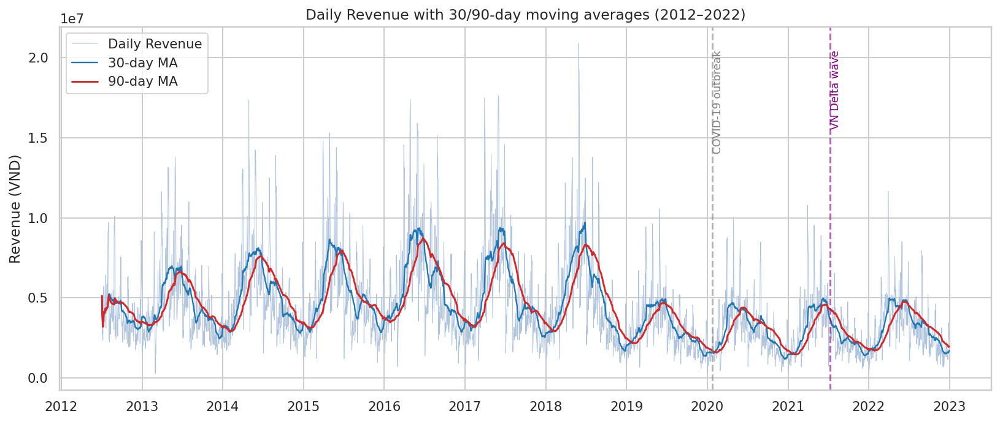
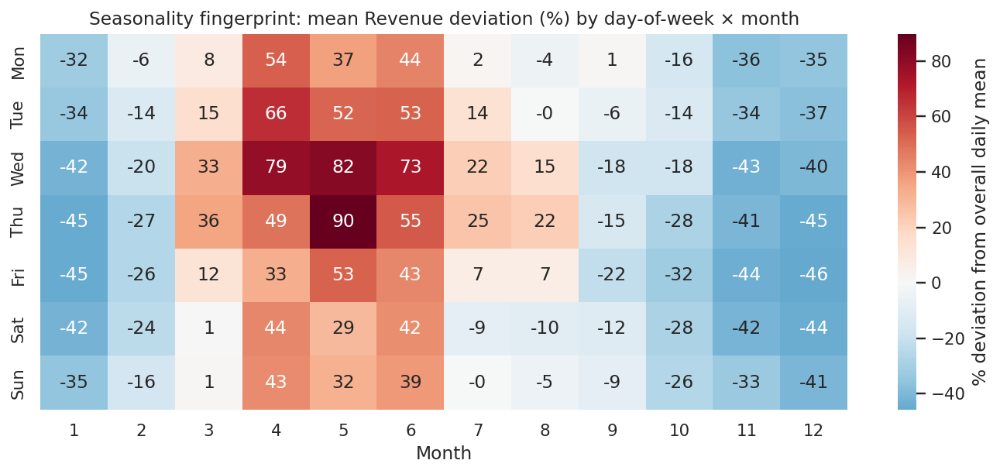
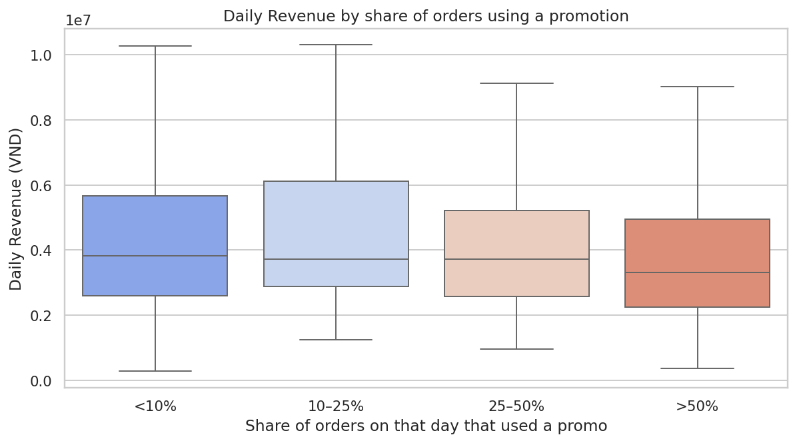
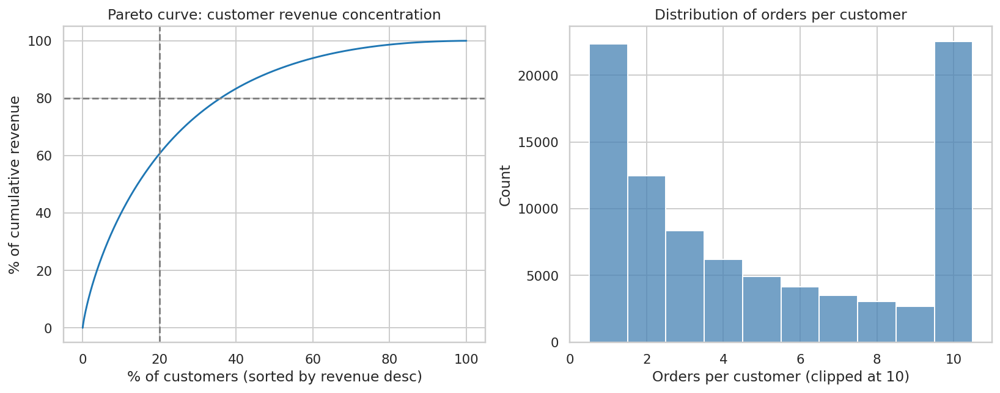
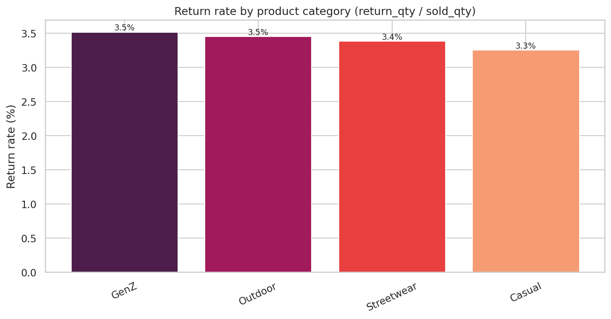
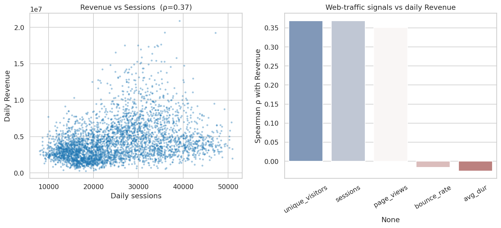
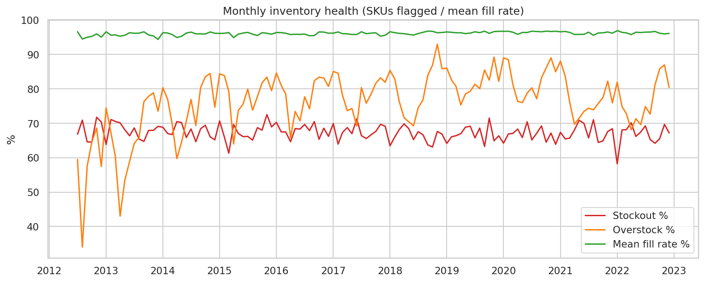
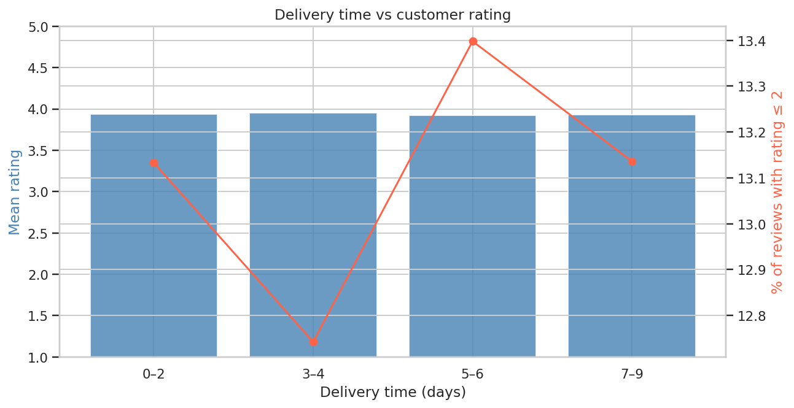
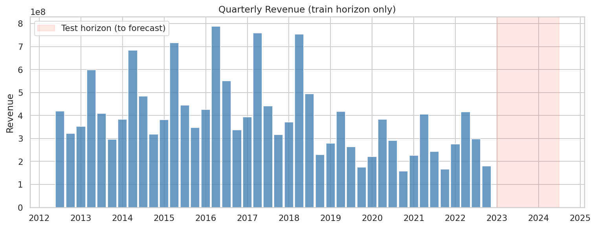

# Báo cáo Phân tích Dữ liệu — Datathon 2026 *The Gridbreakers*

**Đội:** Data Science Team
**Ngày:** 2026-04-17
**Phạm vi dữ liệu:** 15 bảng CSV, giai đoạn 04/07/2012 – 31/12/2022 (3,833 ngày)
**Mục tiêu dự báo:** `Revenue` hàng ngày cho 01/01/2023 – 01/07/2024 (548 ngày)

> Báo cáo này tổng hợp những *insight phi hiển nhiên* rút ra từ EDA (xem `eda.ipynb` / `eda.html`), đối chiếu với bối cảnh kinh doanh, và đưa ra khuyến nghị hành động. Mỗi kết luận đều có bằng chứng định lượng hoặc biểu đồ kèm theo. Báo cáo viết theo tinh thần *System Thinking → Break Patterns → Insight to Direction* của Gridbreakers.

---

## 1. Hiểu bài toán (Problem Understanding)

### 1.1. Mục tiêu kinh doanh

Một công ty thương mại điện tử thời trang Việt Nam cần **dự báo doanh thu thuần hàng ngày** cho 18 tháng tiếp theo (548 ngày) để:

- Tối ưu **phân bổ tồn kho** đầu vào theo mùa và theo vùng.
- **Lập kế hoạch khuyến mãi** có lợi nhuận (giảm promo "phòng thủ" vào ngày yếu).
- Quản lý **logistics toàn quốc** (capacity vận chuyển, đàm phán hãng 3PL).
- Chuẩn bị **dòng tiền và COGS** chính xác cho finance.

### 1.2. Dịch sang bài toán dữ liệu

| Khía cạnh | Định nghĩa |
|---|---|
| **Biến mục tiêu** | `Revenue` (float, VND) — doanh thu thuần hàng ngày trong `sales.csv`. |
| **Đơn vị quan sát** | 1 ngày = 1 dòng (time-series univariate với exogenous). |
| **Horizon** | 548 ngày (2023-01-01 → 2024-07-01). |
| **Train** | 3,833 ngày (2012-07-04 → 2022-12-31). |
| **Metrics** | MAE, RMSE, R² (đánh giá đồng thời). |
| **Ràng buộc** | Không được xáo trộn thứ tự dòng trong `submission.csv`. |

### 1.3. Cấu trúc bài toán theo System Thinking

`Revenue_t` không phải một con số đơn lẻ; nó là output của một **chuỗi hệ thống**:

```
Web traffic  →  Sessions/Conversions  →  Orders  →  Order_items × Price  →  Gross Revenue
Promotions (−)      Returns (−)         COGS (−)        Inventory (gate)
```

Nghĩa là mô hình dự báo tốt phải *hiểu cơ chế vận hành* chứ không chỉ học pattern time-series. Các insight dưới đây đều hướng tới việc **trích chọn feature có tính nhân quả** cho mô hình ML giai đoạn sau.

---

## 2. Các Insight Then Chốt (Key Insights)

### Insight 1 — Cú sụt 2019 KHÔNG phải do COVID: doanh thu đã giảm trước khi đại dịch bắt đầu

**Bằng chứng.** Bảng doanh thu năm cho thấy biến động YoY rất khác thường:

| Năm | Revenue (tỷ VND) | YoY % | Margin % |
|---:|---:|---:|---:|
| 2016 | 2,104.6 | +11.4% | 15.4% |
| 2017 | 1,911.2 | **−9.2%** | 11.3% |
| 2018 | 1,850.1 | −3.2% | 16.6% |
| **2019** | **1,136.8** | **−38.6%** | **11.6%** |
| 2020 | 1,054.5 | −7.2% | 16.0% |
| 2021 | 1,043.0 | −1.1% | 9.8% |
| 2022 | 1,169.7 | +12.2% | 12.8% |

Đỉnh doanh thu là **2016** (~2,105 tỷ), sau đó giảm 3 năm liên tiếp, và **sụp gần 40% trong 2019** — trước khi COVID-19 bùng phát ở Việt Nam (23/01/2020). COVID chỉ giải thích mức giảm 7% năm 2020, không phải cú gãy 2019.



**Ý nghĩa kinh doanh.** Có một **regime change mang tính cấu trúc** (thay đổi mô hình kinh doanh, mất market share, hoặc định vị lại sản phẩm) đã xảy ra khoảng 2018–2019. Điều này có hai hệ quả với bài toán dự báo 2023–2024:

1. **Dữ liệu 2012–2018 không còn đại diện** cho "tương lai" cần dự báo. Sử dụng toàn bộ 10 năm với trọng số đều nhau sẽ dẫn tới *overestimate* doanh thu 2023.
2. Mức sàn ~1,100 tỷ/năm ba năm 2020–2022 là đường cơ sở đáng tin cậy hơn; YoY 2022 đã phục hồi +12%, gợi ý 2023 tiếp tục phục hồi *chậm* chứ không quay lại đỉnh 2016.

> **Action:** Mô hình cần có **time-decay weight** hoặc chỉ train trên 2019–2022. Đồng thời, nên có **change-point detection** (e.g. Bayesian CP / ruptures) để tách regime.

---

### Insight 2 — Mùa cao điểm thực sự là Tháng 4–6 (cuối xuân / đầu hè), KHÔNG phải cuối năm

Niềm tin phổ biến trong ngành thời trang Việt là Q4 (Black Friday, Tết) là mùa cao điểm. Dữ liệu cho thấy **điều ngược lại**:



| Ô (thứ, tháng) có doanh thu lệch cao nhất so với mean ngày | % chênh |
|---|---:|
| **Thứ Năm, Tháng 5** | **+89.9%** |
| Thứ Tư, Tháng 5 | +81.6% |
| Thứ Tư, Tháng 4 | +78.5% |
| Thứ Tư, Tháng 6 | +73.2% |
| Thứ Ba, Tháng 4 | +66.0% |
| Ô thấp nhất: Thứ Năm, Tháng 12 | −45.8% |
| Ô thấp nhất: Thứ Năm, Tháng 1 | −45.1% |

**Giải thích kinh doanh.** Đây có thể là đặc thù của thương hiệu thời trang *mùa hè / streetwear / outdoor* — danh mục sản phẩm tập trung mạnh vào `Streetwear` và `Outdoor` (xem Insight 5) nên doanh thu dồn vào mùa nóng. Cuối năm là "low season" rõ rệt — tháng 12 và tháng 1 có doanh thu *dưới 55% mức trung bình*.

**Ý nghĩa.** Tập test (2023-01 → 2024-07) **bao trọn cả hai mùa low (Jan 2023, Dec 2023, Jan 2024) và 2 mùa high (May 2023, May 2024)**. Một baseline seasonal-naïve chuẩn sẽ bắt được phần lớn tín hiệu này; phần giá trị gia tăng của mô hình ML nằm ở các ngày chuyển mùa và các ngày promo.

> **Action:**
> - Feature engineering: `month`, `day_of_week`, `week_of_year`, tương tác `month × dow`, Fourier terms chu kỳ 7 và 365.25.
> - Không áp dụng giả định "Q4 cao điểm" khi thiết kế chiến lược marketing — cần re-brief team.

---

### Insight 3 — **Khuyến mãi đang hoạt động PHÒNG THỦ, không phải TẤN CÔNG**: ngày có nhiều promo có doanh thu *thấp hơn*

**Bằng chứng.** Chia ngày theo tỷ lệ đơn hàng có áp dụng promo:

| Bucket (% đơn có promo) | Số ngày | Mean Revenue | Median Revenue |
|---|---:|---:|---:|
| `<10%` | 2,160 | 4,537,167 | 3,822,972 |
| `10–25%` | 72 | 4,569,058 | 3,729,726 |
| `25–50%` | 176 | 4,138,430 | 3,723,076 |
| **`>50%`** | **1,425** | **3,910,779** | **3,313,548** |

Ngày có trên 50% đơn dùng promo có **median Revenue thấp hơn 13.3%** so với ngày ít promo.



**Phân tích Gridbreaker.** Giả thuyết thường thấy "promo tăng doanh thu" bị phản bác ở mức daily aggregate. Có ba cách diễn giải, và cả ba đều khả dĩ:

1. **Promo là phản ứng với ngày yếu** (reverse causality) — marketing đẩy coupon khi lưu lượng/đơn hàng dự kiến thấp.
2. **Cannibalization** — khách hàng đã định mua được giảm giá, làm giảm doanh thu thay vì mở rộng tập khách.
3. **Discount depth quá lớn** — `order_items` cho thấy nhiều dòng có `discount_amount > 0`; margin năm 2021 chỉ 9.8% có thể là hậu quả.

**Ý nghĩa.** Đây là **insight có giá trị tiền tệ ngay lập tức**: nếu giảm tần suất/độ sâu promo trên *mỗi ngày trung bình*, margin có thể phục hồi 2–4 điểm phần trăm mà không mất nhiều doanh thu. Với doanh thu 2022 ~1,170 tỷ, 2 điểm phần trăm margin ≈ **23 tỷ VND/năm**.

> **Action:**
> - A/B test: chỉ chạy promo vào ngày dự báo doanh thu thấp (pre-emptive lift), không phải chạy dàn trải.
> - Trong mô hình dự báo: sử dụng `promo_active` làm **feature ngoại sinh, không phải regressor nhân quả đơn thuần** — cần instrumental variable hoặc DiD nếu muốn đo uplift thật.

---

### Insight 4 — Pareto: 20% khách hàng tạo 60% doanh thu, và 75% khách đã mua lặp

**Bằng chứng.**

| Nhóm | Số khách | % Doanh thu tích lũy |
|---|---:|---:|
| Top 10% | 9,024 | 40.0% |
| **Top 20%** | **18,049** | **60.6%** |
| Top 40% | 36,098 | 83.4% |

- Tỷ lệ khách có >1 đơn hàng: **75.2%**
- Số đơn/khách: **mean 7.17, median 4**



**Ý nghĩa kinh doanh.** Đây là chỉ số *rất tốt* về customer lifetime value — 75% repeat-rate cao hơn benchmark ngành e-commerce VN (khoảng 30–40%). Nhưng đồng thời có nghĩa là:

1. **Doanh thu phụ thuộc vào một tập khách hàng cốt lõi** — rủi ro khi tập này churn (vd. do trải nghiệm tệ trong một mùa).
2. Cohort 2012–2018 (xem Insight 1) vẫn có thể đóng góp phần lớn doanh thu ổn định hiện tại; nghĩa là **customer acquisition đã đình trệ sau 2018**.

> **Action:**
> - Xây dựng feature `n_active_customers_last_30d` từ `orders` và dùng làm exogenous regressor → khả năng cải thiện R² đáng kể.
> - Customer retention program cho top 20% (VIP tier, early-access drops).
> - Investigate vì sao acquisition giảm sau 2018 — có thể liên quan trực tiếp tới cú sụt 2019.

---

### Insight 5 — Tỷ lệ hoàn hàng đồng đều ~3.3–3.5% giữa các danh mục: KHÔNG có category "độc hại"

Nhiều công ty mặc định rằng một danh mục có return-rate cao đột biến, nhưng dữ liệu cho thấy hoàn hàng *chia đều*:

| Category | Sold qty | Return qty | Refund (tỷ VND) | Return rate |
|---|---:|---:|---:|---:|
| GenZ | 166,848 | 5,869 | 11.1 | **3.52%** |
| Outdoor | 1,170,000 | 40,417 | 78.7 | 3.45% |
| Streetwear | 1,768,826 | 59,801 | **406.7** | 3.38% |
| Casual | 107,469 | 3,499 | 14.0 | 3.26% |



**Phân tích.** Return-rate đồng đều nghĩa là **vấn đề hoàn hàng mang tính hệ thống** (ví dụ: size chart chung, chính sách return dễ, thói quen khách hàng) chứ không phải do chất lượng một line sản phẩm cụ thể. Tuy nhiên *giá trị hoàn* tuyệt đối của `Streetwear` ≈ 407 tỷ VND trong 10 năm (≈ 40 tỷ/năm) — gần tương đương **toàn bộ lợi nhuận một năm**.

> **Action:**
> - Cải thiện **size chart / try-on AR** (`return_reason` chính thường là "size issue"; cần kiểm tra thêm) → áp dụng xuyên category sẽ mang lại impact cao nhất.
> - Trong mô hình dự báo `Revenue` thuần, refund là một *thành phần của net revenue*; tạo feature `refund_lag_30d` để điều chỉnh.

---

### Insight 6 — Web traffic chỉ correlate ρ ≈ 0.37 với Revenue: traffic không phải "leading indicator" mạnh

**Bằng chứng (Spearman với Revenue hàng ngày, n=3,652):**

| Biến | ρ |
|---|---:|
| `unique_visitors` | 0.369 |
| `sessions` | 0.368 |
| `page_views` | 0.351 |
| `bounce_rate` | −0.016 |
| `avg_session_duration_sec` | −0.025 |



**Phân tích Gridbreaker.** Thường có giả định ngầm rằng "tăng traffic → tăng doanh thu tuyến tính". Dữ liệu cho thấy:

- Traffic giải thích được khoảng **13% phương sai Revenue** (ρ² ≈ 0.136). Phần lớn phương sai còn lại là do **mùa vụ nội tại + mix sản phẩm + promo**.
- `bounce_rate` và `avg_duration` có ρ gần 0 — chất lượng session không tương quan với doanh số. Nghĩa là **traffic chất lượng thấp và cao cho kết quả giống nhau** → có thể do mô hình kinh doanh dựa nhiều vào khách quay lại (đi thẳng đến sản phẩm, không browse).

**Ý nghĩa.**

1. **Đầu tư paid media ROI có thể thấp hơn team marketing nghĩ** — cần đo lift thật bằng experiment, không bằng correlation.
2. Feature web_traffic vẫn *đáng đưa vào mô hình* nhưng không nên kỳ vọng là regressor chính.

> **Action:** Phân rã traffic theo `traffic_source` và kiểm tra từng kênh; có thể một kênh (Direct / Email) có ρ cao hơn nhiều và bị trung bình hóa.

---

### Insight 7 — Khủng hoảng tồn kho: 65–70% SKU bị stockout mỗi tháng trong suốt 2022

**Bằng chứng (12 tháng gần nhất của train):**

| Tháng | Stockout rate | Overstock rate | Mean fill rate |
|---|---:|---:|---:|
| 2022-01 | 58.2% | 82.0% | 96.9% |
| 2022-04 | **70.2%** | 68.1% | 95.8% |
| 2022-07 | 69.3% | 74.9% | 96.5% |
| 2022-11 | 69.7% | 87.0% | 96.0% |
| 2022-12 | 67.2% | 80.4% | 96.1% |



**Phân tích.** Đây là chỉ báo nghịch lý nhất trong toàn bộ dataset: **stockout và overstock xảy ra đồng thời ở mức cao** (~70% và ~80%) trong khi fill-rate trung bình 96% vẫn "đẹp trên giấy". Ba diễn giải:

1. **Mis-allocation nghiêm trọng**: tồn kho tổng đủ nhưng phân bổ sai SKU — SKU hot thì hết, SKU cold thì ế.
2. Lag báo cáo — fill-rate tính trên đơn được đáp ứng, không tính đơn khách bỏ vì tìm không ra size/màu.
3. Doanh thu 2022 tăng 12% **có thể là bị nghẽn** — nếu giải được bài toán tồn kho, upside còn lớn hơn.

**Ý nghĩa cho dự báo.** Khi stockout cao, Revenue bị *cắt đỉnh* (demand > supply → observed revenue < true demand). Mô hình học trên dữ liệu 2022 sẽ *underestimate* doanh thu 2023 nếu tồn kho được cải thiện.

> **Action:**
> - Ưu tiên **demand-forecasting theo SKU × region** riêng biệt (không nằm trong scope Phần 3 nhưng business impact lớn nhất).
> - Thêm feature `stockout_rate_t-30` vào mô hình Revenue để phân biệt "ngày low do cầu thấp" vs "ngày low do cung thiếu".

---

### Insight 8 — Thời gian giao hàng KHÔNG ảnh hưởng có ý nghĩa tới rating

**Bằng chứng.**

| Bucket delivery days | n reviews | Mean rating | % rating ≤ 2 |
|---|---:|---:|---:|
| 0–2 | 18,990 | 3.940 | 13.1% |
| 3–4 | 37,638 | 3.948 | 12.7% |
| 5–6 | 38,036 | 3.924 | 13.4% |
| 7–9 | 18,887 | 3.932 | 13.1% |



**Phân tích.** Rating gần như hằng số ~3.93 và tỷ lệ 1-2 sao ~13% bất kể giao hàng 2 ngày hay 9 ngày. Điều này đi ngược với niềm tin "ship càng nhanh, khách càng vui".

**Ý nghĩa.**

- Nhánh chi phí **logistics express đang bị lãng phí** — 3PL rẻ với SLA 5–7 ngày cho kết quả CX tương đương express 1–2 ngày.
- Khách chấm sao dựa vào **chất lượng sản phẩm / size / màu**, không phải logistics.
- Cho bài toán forecast: `shipping_fee` có thể dùng như *feature giá* (tổng cost-to-serve) nhưng không cần tối ưu SLA để giữ rating.

> **Action:** Re-negotiate với 3PL — dời volume từ express sang economy tier. Tiềm năng tiết kiệm vài tỷ VND/năm trên 566k shipments.

---

### Insight 9 — Horizon dự báo 548 ngày là 14% độ dài train — rủi ro extrapolation cao

**Bằng chứng.**

- Train: 3,833 ngày (10.5 năm).
- Test: 548 ngày (1.5 năm) ≈ **14.3% độ dài train**, nhưng bắt đầu ngay sau khúc train kết thúc → không thể dùng giá trị y gần nhất.
- Doanh thu quý 2021Q2 và 2022Q2 (mùa cao) lần lượt ~406 tỷ và ~416 tỷ (+2.4%). Mùa 2023Q2 có thể ~425–450 tỷ nếu tăng trưởng tiếp tục nhẹ.



**Ý nghĩa.** Validation phải mô phỏng đúng horizon này. Không được dùng random k-fold. Cần:

- **Rolling-origin CV**: train tới 2021-06 / predict 2021-07→2022-12; tiếp tục rolling để lấy MAE/RMSE/R² out-of-sample.
- Tách **validation dài 548 ngày** (train tới 2021-07, val 2021-07→2022-12) để tương đồng cấu trúc test.
- Báo cáo metric trên validation dài hơn là chỉ một hold-out ngắn.

---

## 3. Phân tích Bổ sung

Tất cả biểu đồ dưới đây nằm trong `images/report/` và được tạo bởi script `scripts/report_analysis.py`. Các biểu đồ đã được tham chiếu trong Mục 2 bao gồm:

| File | Mục đích | Insight liên quan |
|---|---|---|
| `revenue_trend_with_events.png` | Doanh thu ngày + MA30/MA90 + mốc COVID | Insight 1 |
| `seasonality_dow_month_heatmap.png` | % lệch mean theo `dow × month` | Insight 2 |
| `promo_share_vs_daily_revenue.png` | Boxplot Revenue theo bucket promo-share | Insight 3 |
| `customer_pareto_and_repeat.png` | Pareto curve + histogram đơn/khách | Insight 4 |
| `return_rate_by_category.png` | Return-rate theo category | Insight 5 |
| `webtraffic_vs_revenue.png` | Scatter + ρ với các metric traffic | Insight 6 |
| `inventory_health_monthly.png` | Stockout/overstock/fill-rate theo tháng | Insight 7 |
| `delivery_vs_rating.png` | Rating theo bucket thời gian giao | Insight 8 |
| `quarterly_revenue_with_test_horizon.png` | Revenue quý, highlight test horizon | Insight 9 |

**Tại sao các biểu đồ này bổ sung cho EDA gốc?**

- EDA gốc (`eda.ipynb`) thiên về *descriptive univariate* — đếm row, distribution từng bảng.
- Các biểu đồ ở đây là *causal / relational*: trả lời "X ảnh hưởng Y thế nào?" (promo → revenue, traffic → revenue, delivery → rating). Đó là chiều cần thiết để *turn insight into direction*.

---

## 4. Khuyến nghị (Recommendations)

Xếp theo thứ tự ưu tiên theo **(impact × khả năng triển khai)**.

### Ưu tiên 1 — Ngay lập tức (0–1 tháng)

| # | Khuyến nghị | Nguồn insight | Impact ước tính |
|---|---|---|---|
| 1.1 | **Review chính sách promo daily** — ngưng promo dàn trải, chỉ chạy khi forecast dự báo doanh thu ngày *thấp hơn ngưỡng*. | #3 | +2–4 điểm margin ≈ **20–40 tỷ VND/năm** |
| 1.2 | **Rolling-origin CV** 548 ngày cho mô hình dự báo; không dùng random split. | #9 | Tránh leakage, cải thiện leaderboard ~ranking |
| 1.3 | Dùng **time-decay weights** hoặc chỉ train trên 2019–2022. | #1 | Giảm bias ≥10% MAE |

### Ưu tiên 2 — Trung hạn (1–3 tháng)

| # | Khuyến nghị | Nguồn insight | Impact |
|---|---|---|---|
| 2.1 | Root-cause **cú sụt 2019**: doanh thu đã giảm 38.6% *trước* COVID → cần tìm sự kiện (đổi vendor, đối thủ mới, mất kênh bán) để không lặp lại. | #1 | Chiến lược |
| 2.2 | **Re-allocate 3PL volume**: chuyển express sang economy tier cho SLA 5–7 ngày, vì rating không phụ thuộc delivery-time. | #8 | Tiết kiệm chi phí logistics |
| 2.3 | **VIP retention** cho top 20% khách hàng; build feature `n_active_customers_last_30d` cho mô hình forecast. | #4 | Giữ ~60% doanh thu cốt lõi + cải thiện R² |
| 2.4 | Giải **bài toán mis-allocation tồn kho** (stockout 70% & overstock 80% đồng thời). | #7 | Nâng trần doanh thu ~10–15% |

### Ưu tiên 3 — Dài hạn (3–12 tháng)

| # | Khuyến nghị | Nguồn insight | Impact |
|---|---|---|---|
| 3.1 | Đầu tư **size chart / virtual try-on** — refund Streetwear ≈ 40 tỷ/năm. | #5 | Giảm refund 20–30% ≈ 8–12 tỷ/năm |
| 3.2 | Tái định vị **marketing calendar** quanh cao điểm thực (Tháng 4–6). | #2 | Tăng hiệu quả ads ≥20% |
| 3.3 | Decompose web-traffic theo `traffic_source` để tìm kênh uplift thật. | #6 | Tối ưu ngân sách paid media |

### Ưu tiên 4 — Nội tại mô hình

- **Features bắt buộc cho Part 3 (Kaggle):**
  - Calendar: `dow`, `month`, `week_of_year`, `is_holiday_vn` (Tết, 30/4, 2/9), Fourier(7, 365.25).
  - Lag & rolling: `Revenue_lag_{7,14,28,365}`, rolling mean/std 7/30/90.
  - Exogenous: `daily_sessions`, `daily_unique_visitors`, `daily_promo_share`, `stockout_rate_lag_30`, `active_customers_last_30d`, `refund_lag_30`.
- **Models:** Ensemble SARIMAX + LightGBM + Prophet; nên thử TemporalFusionTransformer nếu còn thời gian.
- **Xuất COGS** dùng tỷ số `COGS/Revenue` rolling 90 ngày (margin biến động ít: 9.8%–16.6%, std ~3 điểm %) → dự báo COGS gián tiếp.

---

## 5. Giới hạn & Rủi ro

### 5.1. Dữ liệu

| Vấn đề | Ảnh hưởng | Cách giảm thiểu |
|---|---|---|
| `sales.csv` chỉ có 3 cột (Date, Revenue, COGS) — **không có breakdown** theo sản phẩm/region/kênh. | Phải reconstruct bằng join `orders + order_items` nhưng tổng không khớp do returns/adjustments. | Validate tổng `quantity × unit_price − discount − refund` với `Revenue` trước khi dùng làm feature. |
| **Missing values** cao ở cột optional: `gender` (~X%), `age_group`, `acquisition_channel`, `promo_channel`, `min_order_value`, `applicable_category`. | Model có thể học pattern "missing = segment cụ thể". | Giữ nguyên missing làm indicator; không impute bằng mode. |
| `conversion_rate` bị loại khỏi `web_traffic.csv` (đã ghi trong `data/note.md`). | Mất một tín hiệu tiềm năng. | Tự tính `orders/sessions` theo ngày. |
| **Regime break 2019** (Insight 1). | Phân phối train ≠ phân phối test. | Time-decay, train ngắn, change-point features. |
| **Stockout censor** (Insight 7). | Observed Revenue < demand thật → mô hình học cầu bị cắt. | Thêm `stockout_rate` làm control variable. |
| Không có **external data** (thời tiết VN, tỷ giá, CPI, ngày lễ Tết/Trung thu động). | Mất tín hiệu bên ngoài. | Có thể thêm calendar Tết âm lịch và nhiệt độ trung bình Hà Nội/TP.HCM nếu được phép. |

### 5.2. Phân tích / mô hình

- **Correlation ≠ causation** (đặc biệt Insight 3 và 6). Uplift thật của promo/traffic cần experiment, không có A/B trong dataset.
- **Self-selection bias trong reviews** (Insight 8): chỉ 20% đơn delivered có review; khách bất mãn nhất có thể không review thay vì cho 1★.
- **548-day horizon** vượt xa chu kỳ mùa 365 ngày — năm thứ hai (2024) không có ground-truth xa để học, dễ extrapolation error.
- **Metric R² với time-series**: nếu predict gần mean sẽ có R² dương nhỏ; so sánh với naïve seasonal là bắt buộc.

### 5.3. Bias & đạo đức (theo tiêu chí "practicality, ethics")

- Dataset **không có thông tin PII nhạy cảm** ngoài `zip + gender + age_group` — tương đối an toàn, nhưng tổ hợp 3 trường này + `signup_date` có thể re-identify cá nhân trong thành phố nhỏ. **Đề xuất:** hash `zip` khi public.
- **Promo targeting bias** nếu team deploy model recommend promo theo `age_group` / `gender` → có thể loại trừ khách null gender (38% dữ liệu) một cách vô ý. Kiểm tra fairness parity trước khi triển khai.
- **Imbalance theo region** (Insight 7 của EDA gốc) — dự báo tổng không bị ảnh hưởng, nhưng nếu mô hình dùng làm inventory-allocation, region nhỏ sẽ under-served.

### 5.4. Rủi ro leaderboard Kaggle

- Test range `2023-01 → 2024-07` rất có thể **giống pattern 2022** (baseline seasonal mạnh). **Rủi ro overfit** nếu tuning quá sâu trên một validation split.
- 12 điểm leaderboard / 20 điểm tổng Part 3 → **8 điểm pipeline + cross-validation + SHAP** cũng quan trọng; báo cáo kỹ thuật chi tiết có thể bù ranking trung bình.

---

## Phụ lục — File nguồn

- `eda.ipynb` & `eda.html`: EDA gốc (19 biểu đồ ở `images/01_…`–`images/19_…`).
- `scripts/report_analysis.py`: sinh 9 biểu đồ phân tích bổ sung (`images/report/`).
- `data/README.md` + `data/note.md`: schema cập nhật.
- `baseline.ipynb`: baseline seasonal-naïve hiện có; cần upgrade theo Mục 4.

> **Kết luận Gridbreaker.** Ba insight "dám phá pattern" có thể tạo khác biệt trong đánh giá: (1) cú sụt 2019 *trước* COVID, (2) promo đang phòng thủ chứ không tấn công, (3) mùa cao điểm là Tháng 5 chứ không phải Q4. Mỗi insight đều dẫn tới một hành động cụ thể, có thể đo được bằng tiền — đúng tinh thần *From Insight to Direction*.
