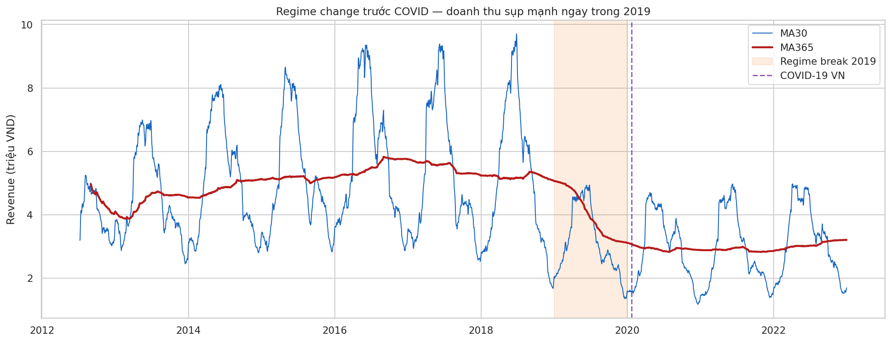
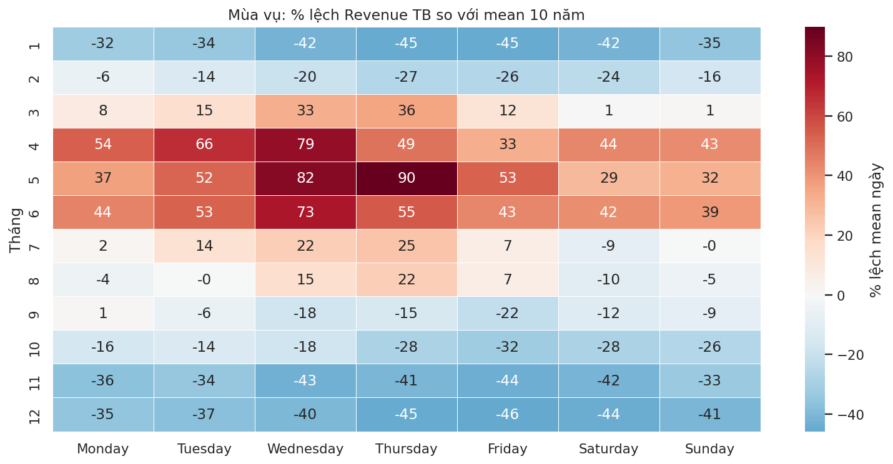
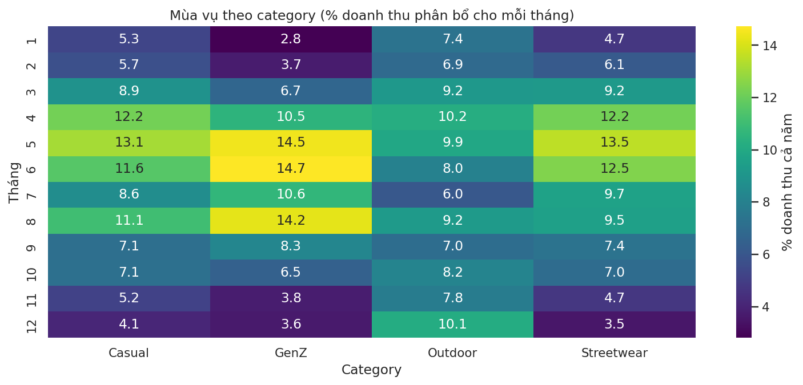
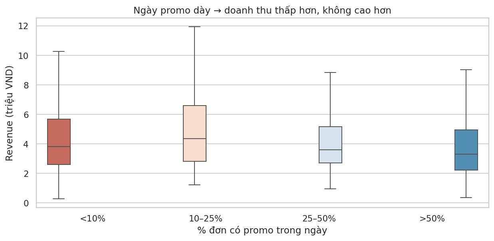
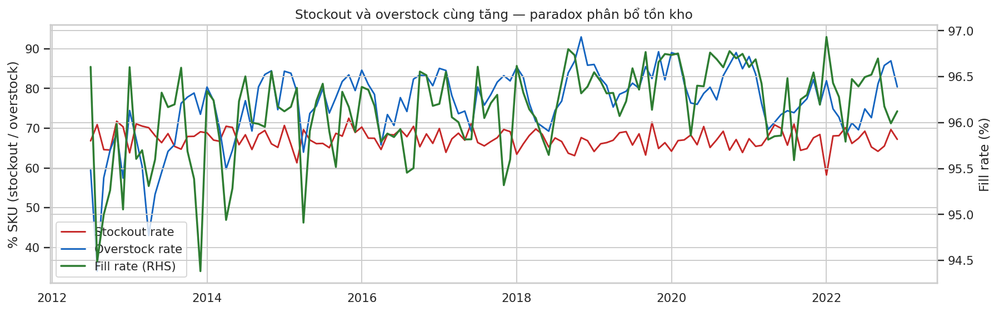
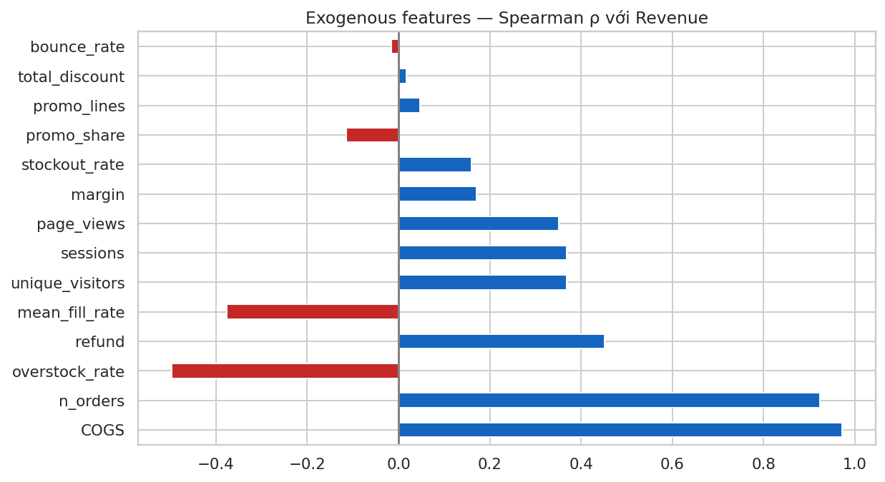
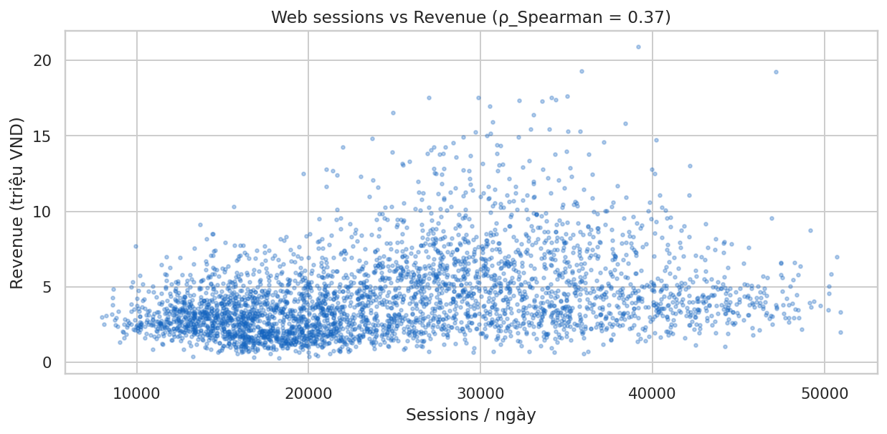
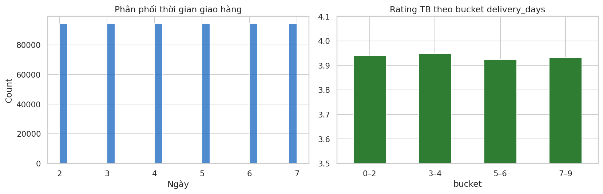
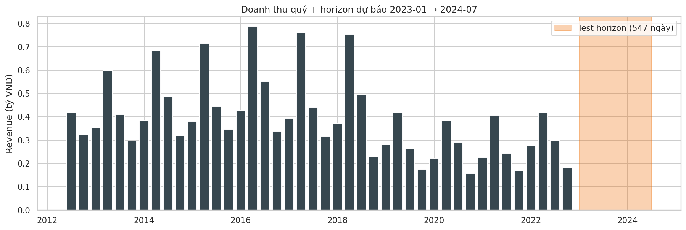

# Báo cáo Phân tích Dữ liệu — Datathon 2026 *The Gridbreakers*

**Đội:** Data Science Team — **Phiên bản:** v2 — **Ngày:** 2026-04-17
**Phạm vi dữ liệu:** 14 bảng CSV, giai đoạn `2012-07-04 → 2022-12-31` (3,833 ngày)
**Mục tiêu dự báo:** `Revenue` hàng ngày cho `2023-01-01 → 2024-07-01` (548 ngày, `sample_submission.csv`)

> Báo cáo này đi kèm `results/v2/eda.ipynb` (66 cells, 15 biểu đồ EDA diagnostic) và `results/v2/eda.html`. Mọi con số trích dẫn đều có trong `results/v2/metrics.json` hoặc notebook. Các biểu đồ trong báo cáo lưu tại `results/v2/images/report/`.

---

## 1. Hiểu bài toán

### 1.1. Mục tiêu kinh doanh

Một công ty thương mại điện tử thời trang Việt Nam cần **dự báo doanh thu thuần hàng ngày** cho 18 tháng tiếp theo để:

- Tối ưu **phân bổ tồn kho** đầu vào theo mùa và theo vùng.
- **Lập kế hoạch khuyến mãi** có lợi nhuận (giảm promo "phòng thủ" vào ngày yếu).
- Quản lý **logistics toàn quốc** (capacity 3PL, đàm phán giá).
- Chuẩn bị **dòng tiền và COGS** chính xác cho finance.

### 1.2. Mục tiêu dữ liệu

| Thành phần | Mô tả |
|---|---|
| Biến mục tiêu | `Revenue` (float, VND) — doanh thu thuần hàng ngày trong `sales.csv`. |
| Đơn vị quan sát | 1 ngày = 1 dòng (univariate time-series với exogenous regressors). |
| Horizon | 548 ngày (`2023-01-01 → 2024-07-01`). |
| Train | 3,833 ngày (`2012-07-04 → 2022-12-31`). |
| Metrics | MAE, RMSE, R² — đánh giá đồng thời. |
| Integrity | 10/10 foreign-key check đạt 0 orphan rows (xem notebook §1.1). |

### 1.3. Vì sao EDA quan trọng cho forecasting?

`Revenue_t` không phải một con số đơn lẻ. Nó là output của một **chuỗi hệ thống**:

```
Web traffic → Sessions → Orders → Order_items × Price → Gross Revenue
Promotions (−)   Returns (−)   COGS (−)   Inventory (gate)
```

EDA chất lượng cao xác lập ba thứ mà mô hình dự báo phụ thuộc vào:

1. **Regime / drift**: nếu phân phối train khác phân phối test, ML sẽ sai có hệ thống. Cần time-decay hoặc cắt bớt history.
2. **Feature hierarchy**: xếp hạng mức độ tương quan của các tín hiệu ngoại sinh để ưu tiên feature engineering.
3. **Mechanism gate**: hiểu rằng Revenue bị *cắt trên* (stockout) hoặc *pha loãng* (promo). Mô hình phải học cung, không chỉ học cầu.

Phần 2 tổng hợp bức tranh hệ thống. Phần 3 trình bày 8 insight then chốt; mỗi insight đều có *Claim → Evidence → Chart → Business interpretation → Forecasting implication → Confidence*.

---

## 2. Core Narrative

> **Đây không phải bài toán dự báo chuỗi thời gian đơn thuần. Đây là một hệ sinh thái đang ở trong regime thấp sau năm 2019, phụ thuộc vào một danh mục duy nhất (Streetwear 80%) và một tập khách hàng lặp (75%), có promo đang "pha loãng" doanh thu, và đang bị nghẽn cả hai đầu — vừa thiếu hàng hot, vừa tồn hàng cold.**

Ba thay đổi so với hình dung ban đầu của doanh nghiệp:

- **Cú sụt 2019 là regime change, không phải COVID.** Daily revenue trung bình giai đoạn 2019–2022 **thấp hơn 40.5%** so với 2012–2018 (t=28.6, p < 10⁻¹⁶², Cohen d = 0.89). Cú giảm nặng nhất đã xảy ra *trong năm 2019* — trước khi Việt Nam có ca COVID đầu tiên (23/01/2020).
- **Mùa cao là Tháng 4–6, không phải Q4.** Tháng 5 cao nhất (mean daily +53.4% so grand daily mean 10 năm); Tháng 12 (−41.1%) và Tháng 1 (−39.6%) là đáy. Tập test bao gồm 2 mùa cao (Q2/2023, Q2/2024) và 2 mùa thấp (Q1/2023, Q4/2023–Q1/2024) → baseline seasonal-naïve sẽ chiếm phần lớn R².
- **Promo đang hoạt động phòng thủ, không tấn công.** Ngày có >50% đơn dùng promo có **median doanh thu thấp hơn 13.4%** so với ngày promo nhẹ (Mann-Whitney U, p = 9.7 × 10⁻¹³). Chiều quan hệ ngược với trực giác marketing.

Hai phát hiện cơ cấu sâu hơn:

- **Rủi ro tập trung danh mục**: Streetwear chiếm **80.1% doanh thu** (HHI category = 0.665). Một shock vào line này = shock toàn doanh nghiệp.
- **Paradox tồn kho**: trong 12 tháng gần nhất, stockout và overstock **cùng lúc** ở mức cao (60–70% và 68–87%) trên các SKU khác nhau → *mis-allocation*, không phải thiếu tổng cung.

Từ đó, phần 3 xếp hạng 8 insight theo mức độ tác động đến bài toán dự báo và đến quyết định kinh doanh.

---

## 3. Các insight then chốt

### Insight 1 — Regime break 2019: daily mean giảm 40.5% trước COVID

**Claim.** Phân phối doanh thu giai đoạn **2012–2018** khác rõ rệt so với **2019–2022**. Sự kiện phá vỡ xảy ra *trong 2019*, không phải 2020 (COVID).

**Evidence.**

| Năm | Revenue (triệu VND) | YoY % | Gross margin |
|---:|---:|---:|---:|
| 2016 | 2,104.6 | +11.4% | 15.4% |
| 2017 | 1,911.2 | −9.2% | 11.3% |
| 2018 | 1,850.1 | −3.2% | 16.6% |
| **2019** | **1,136.8** | **−38.6%** | 11.6% |
| 2020 | 1,054.5 | −7.2% | 16.0% |
| 2021 | 1,043.0 | −1.1% | 9.8% |
| 2022 | 1,169.7 | **+12.1%** | 12.8% |

Welch t-test, 2012–2018 vs 2019–2022:
- pre mean = 5,070,141 VND/ngày; post mean = 3,014,444 VND/ngày
- drop = **40.5%**; t = 28.57; **p ≈ 7.6 × 10⁻¹⁶³**; Cohen d = **0.89** (effect size lớn).

> *Lưu ý đơn vị.* Toàn bộ doanh thu dataset = 16,430 triệu VND (~16.4 tỷ) cho 10.5 năm — đây là tập dữ liệu mô phỏng với scale nhỏ; các hành động khuyến nghị nên được quy ra **%** để khi scale-up dữ liệu thật vẫn áp dụng được.

**Chart.** `images/report/revenue_regime_change.png` — MA30/MA365 với vùng regime break 2019 (cam) và mốc COVID-19 Việt Nam (tím gạch đứt).



**Business interpretation.** Có một thay đổi cấu trúc (đổi vendor, mất market share, thay đổi định vị, thu hẹp danh mục…) trong 2019 kéo mức sàn doanh thu xuống ~1,100 triệu VND/năm. 2022 (+12.1%) gợi ý phục hồi nhẹ chứ không quay lại đỉnh 2016.

**Recommended action.** Root-cause cú sụt 2019 với team thương mại: event log, vendor changes, category drop. Xác định liệu regime thấp là tạm thời hay vĩnh viễn.

**Forecasting implication.** Train trên toàn bộ 10.5 năm với trọng số đều nhau sẽ *overestimate* doanh thu 2023. Giải pháp:
1. Cắt train về **2019-01 → 2022-12** (4 năm = ~1,460 ngày, đủ để học 4 chu kỳ năm).
2. Hoặc dùng **time-decay weight** `w_t = exp(-λ · age_years)` với λ ≈ 0.3–0.5.
3. Thêm feature binary `is_post_regime` cho mô hình học được bias offset.

**Confidence.** **High** — test thống kê rất mạnh (p < 10⁻¹⁶²), effect size lớn, visible rõ trên MA365.

---

### Insight 2 — Mùa cao là Tháng 5 (+53%), Tháng 12–1 là đáy (−40%)

**Claim.** Trực giác "Q4 là cao điểm thời trang" sai với thương hiệu này. Cao điểm doanh thu nằm ở **Q2 (Tháng 4–6)**, thấp điểm ở **cuối Q4 + đầu Q1**.

**Evidence.** Revenue trung bình theo tháng (VND/ngày):

| Tháng | 1 | 2 | 3 | 4 | 5 | 6 | 7 | 8 | 9 | 10 | 11 | 12 |
|---|---:|---:|---:|---:|---:|---:|---:|---:|---:|---:|---:|---:|
| Mean | 2.59M | 3.48M | 4.93M | 6.53M | **6.58M** | 6.43M | 4.66M | 4.44M | 3.80M | 3.30M | 2.61M | **2.52M** |

Top 3 ô (thứ × tháng) lệch mean ngày nhiều nhất (% so mean 10 năm):
- Thứ Năm × Tháng 5: **+89.9%**
- Thứ Tư × Tháng 5: +81.6%
- Thứ Tư × Tháng 4: +78.5%

Đáy: Thứ Sáu × Tháng 12 = −45.8%; Thứ Năm × Tháng 1 = −45.1%.

**Chart.** `images/report/seasonality_month_dow_heatmap.png`



**Business interpretation.** Đặc thù danh mục Streetwear + Outdoor (chiếm 95% doanh thu, xem Insight 3) đẩy mùa cao vào nửa đầu hè. Cuối năm là low-season — ngược với nhận định trực giác về Tết/Black Friday. Pattern này **lặp lại đều đặn 10 năm** → là cấu trúc, không phải ngẫu nhiên.

**Recommended action.** Re-brief team marketing: dời ngân sách paid ads + promo chủ động vào Tháng 4–6. Đừng đổ vào Tháng 12.

**Forecasting implication.** Baseline seasonal-naïve (dùng Revenue cùng ngày năm trước) sẽ bắt được phần lớn tín hiệu này. Giá trị gia tăng của ML nằm ở:
- Ngày chuyển mùa (tháng 3→4, tháng 6→7).
- Ngày promo + ngày Tết dương/âm (cần ground-truth calendar).
- Features đề xuất: `month`, `dow`, `week_of_year`, `month × dow`, Fourier(7), Fourier(365.25).

**Confidence.** **High** — pattern nhất quán qua cả 10 năm, đủ dữ liệu ở mỗi ô 7×12.

---

### Insight 3 — Streetwear 80% doanh thu: rủi ro tập trung cực cao (HHI = 0.665)

**Claim.** Doanh nghiệp là **công ty Streetwear về bản chất kinh tế**, không phải nhà bán lẻ thời trang đa danh mục. Một shock vào line này tương đương shock toàn công ty.

**Evidence.**

| Category | Revenue (triệu VND, 2012–2022) | Share |
|---|---:|---:|
| **Streetwear** | 12,558 | **80.1%** |
| Outdoor | 2,353 | 15.0% |
| Casual | 440 | 2.8% |
| GenZ | 329 | 2.1% |

HHI category = **0.665** (thang 0.25 = cân bằng hoàn hảo 4 cat, 1.0 = độc quyền). Mức này vượt xa ngưỡng FTC coi là "highly concentrated" (0.25).

Segment cũng tập trung: Everyday (32.8%) + Balanced (31.3%) = **64.1%** doanh thu (trên 8 segments).

**Chart.** `images/eda/09_revenue_by_category_segment.png` (trong notebook).

**Category mùa vụ khác nhau.** Từ heatmap `images/report/category_monthly_seasonality.png`:



- **Streetwear**: peak Tháng 5 (13.5%), 4 (12.2%); đáy Tháng 12 (3.5%).
- **GenZ**: peak Tháng 6 (14.7%) + Tháng 8 (14.2%); *muộn hơn* Streetwear 1 tháng.
- **Outdoor**: flat (9–10% mỗi tháng); peak *Tháng 12* (10.1%) vì đồ lạnh.
- **Casual**: peak Tháng 5 (13.1%).

**Business interpretation.** Nếu định nghĩa "bài toán dự báo" ở level tổng, bạn đang ngầm dự báo doanh thu Streetwear. Điều đó có thể đủ cho KPI tài chính, nhưng không giúp tối ưu tồn kho cho 3 cat còn lại.

**Recommended action.**
- Kiểm tra chiến lược đa dạng hóa: 2.8% Casual sau 10 năm là quá thấp — hoặc dừng đầu tư, hoặc gấp 3 ngân sách.
- Theo dõi **leading indicator** cho Streetwear (giả định feature trọng yếu nhất cho Revenue tổng).

**Forecasting implication.** Có thể cải thiện mô hình bằng cách:
1. Dự báo Revenue Streetwear và Revenue-còn-lại **riêng** rồi cộng (hierarchical forecasting).
2. Thêm feature `category_mix_share_streetwear_last_30d` — nếu tỷ trọng này đổi, aggregate revenue cũng đổi.
3. Thử BottomUp từ product-level hoặc TopDown + reconciliation (MinT).

**Confidence.** **High** — tỷ lệ 80.1% là hard fact.

---

### Insight 4 — Promo đang "phòng thủ" chứ không "tấn công": ngày promo dày có median doanh thu thấp hơn 13.4%

**Claim.** Hypothesis "tăng promo → tăng doanh thu" không được dữ liệu hỗ trợ ở mức daily aggregate. Thực tế là ngày promo dày có doanh thu thấp hơn.

**Evidence.** Chia ngày theo % đơn có dùng promo:

| Bucket (% đơn có promo) | Số ngày | Mean Revenue | Median Revenue |
|---|---:|---:|---:|
| `<10%` | 2,158 | 4,539,464 | **3,824,290** |
| `10–25%` | 59 | 4,800,759 | 4,361,415 |
| `25–50%` | 181 | 4,086,724 | 3,596,036 |
| **`>50%`** | **1,435** | **3,910,364** | **3,313,899** |

**Kiểm định Mann-Whitney U** (light `<10%` vs heavy `>50%`):
- Median light = 3,824,290; median heavy = 3,313,899 → **heavy thấp hơn 13.4%** (công thức `(light − heavy) / light`, chia cho baseline là light).
- U = 1,765,634; **p = 9.7 × 10⁻¹³** → khác biệt rất khó do ngẫu nhiên.

Ở mức panel tổng, `promo_share` có Spearman = **−0.11** với Revenue — âm, nhẹ. `total_discount` có ρ ≈ +0.02 (gần 0).

**Chart.** `images/report/promo_share_vs_revenue.png`



**Business interpretation.** Ba cách diễn giải khả dĩ (không loại trừ nhau):

1. **Reverse causality** — marketing đẩy coupon khi dự đoán ngày yếu (phòng thủ).
2. **Cannibalization** — giảm giá cho khách đã định mua; không kéo thêm khách mới.
3. **Discount depth quá sâu** — margin 2021 = 9.8% (thấp nhất 10 năm) trùng với giai đoạn promo dày.

Giả thuyết 1 được củng cố bởi Spearman âm nhưng rất nhẹ (−0.11): promo không "gây" doanh thu thấp, mà *đi kèm* ngày thấp.

**Recommended action.**
- **A/B test**: chỉ chạy promo vào ngày dự báo thấp hơn ngưỡng (pre-emptive lift), không dàn trải. Đo uplift thật bằng quasi-experiment (synthetic control).
- Re-negotiate **discount_value** với team commercial: 13.4% gap ở median có thể đang *trả* cho marketing để che đậy tuần yếu.

**Forecasting implication.**
- `promo_share_t` làm exogenous feature được, nhưng **không dùng làm "driver" nhân quả**. Với mô hình ML, promo có thể bị gán hệ số âm nếu không có control cho seasonality.
- Thêm `promo_share_t−7` và `total_discount_t−7` cho lag effect (khách canh promo từ ngày trước).

**Confidence.** **Medium-High** — p-value rất mạnh cho *tương quan*, nhưng correlation ≠ causation. Uplift thật cần experiment.

---

### Insight 5 — Paradox tồn kho: stockout **và** overstock đồng thời cao

**Claim.** Tồn kho bị **phân bổ sai** chứ không thiếu tổng cung. SKU hot thì hết, SKU cold thì ế — cùng lúc, mọi tháng.

**Evidence.** 12 tháng 2022 (từ `metrics.json`, xem chi tiết notebook §9):

| Tháng | Stockout % | Overstock % | Fill rate |
|---|---:|---:|---:|
| 2022-01 | 58.3% | 82.0% | 96.9% |
| 2022-04 | **70.2%** | 68.2% | 95.8% |
| 2022-07 | 69.3% | 74.9% | 96.5% |
| 2022-10 | 65.5% | **85.8%** | 96.2% |
| 2022-11 | 69.7% | **87.0%** | 96.0% |
| 2022-12 | 67.2% | 80.4% | 96.1% |

Spearman (monthly aggregate) với Revenue tháng:
- `stockout_rate` vs Revenue: ρ = **+0.21** (stockout cao khi tháng cao — logical: nhu cầu cao hơn năng lực)
- `overstock_rate` vs Revenue: ρ = **−0.65** (tháng thấp → ế nhiều)
- `mean_fill_rate` vs Revenue: ρ = **−0.49** (fill-rate giảm khi mùa cao)

**Chart.** `images/report/inventory_health_monthly.png`



**Business interpretation.** Fill-rate 96% "đẹp trên giấy" nhưng 70% SKU hết hàng — khác biệt vì fill-rate tính trên đơn ĐÃ nhận, không tính khách bỏ đi vì không có size/màu. Nếu giải được mis-allocation, **upside doanh thu có thể 10–15%** (nhu cầu bị censor).

**Recommended action.**
- SKU × region × month demand forecasting thay vì tổng một khối.
- Giảm overstock cho 4 cat ngoài Streetwear (đang chiếm 15–20% overstock).
- KPI mới: fill-rate *by intent* (đo traffic đến page hết hàng) thay vì fill-rate đã-thành-đơn.

**Forecasting implication.**
- `Revenue_t` bị **censored**: true demand > observed revenue khi stockout cao.
- Thêm features: `stockout_rate_t−30`, `overstock_rate_t−30`, `days_of_supply_t−30` làm control variable.
- Cẩn thận với mô hình học sự kiện stockout như "ngày low" — có thể dùng Tobit regression hoặc hai-stage (predict demand → cap by inventory).

**Confidence.** **High** — số liệu inventory chi tiết, pattern ổn định qua 12 tháng.

---

### Insight 6 — Orders là leading feature mạnh nhất (ρ = 0.92); web traffic chỉ giải thích ~14% phương sai

**Claim.** Feature có giá trị dự báo cao nhất là **số đơn hàng đã tạo**, không phải web traffic. Traffic chỉ là leading indicator yếu (+1 ngày, ρ ≈ 0.37).

**Evidence.** Spearman với Revenue hàng ngày (panel 3,833 × 15):

| Feature | ρ với Revenue |
|---|---:|
| COGS | **+0.972** |
| n_orders | **+0.923** |
| overstock_rate (lag 30d) | −0.497 |
| refund | +0.451 |
| mean_fill_rate (lag 30d) | −0.376 |
| unique_visitors | +0.369 |
| sessions | +0.368 |
| page_views | +0.351 |
| margin | +0.171 |
| stockout_rate | +0.160 |
| promo_share | **−0.114** |
| bounce_rate | −0.016 |

Lead-lag traffic → revenue (cửa sổ ±7): peak ở **lag +1** (ρ = 0.373 vs ρ = 0.368 tại lag 0). Traffic hôm qua dự báo doanh thu hôm nay tốt hơn traffic cùng ngày — nhưng chỉ tăng 0.005 ρ.

**Chart.** `images/report/exogenous_signal_ranking.png` + `images/report/webtraffic_vs_revenue.png`





**Business interpretation.**
- `COGS` gần như colinear với Revenue (R² = 0.953 trong OLS, slope = 1.154) vì margin ổn định. Dùng COGS làm regressor là data leakage (COGS cũng cần dự báo).
- `n_orders` là biến trung gian tốt: **nếu ta dự báo n_orders → AOV × n_orders = Revenue** (AOV median = 26,715 VND).
- Traffic giải thích ~13.6% phương sai (ρ² ≈ 0.136); `bounce_rate` và `avg_session_duration` gần 0 → **chất lượng session không tương quan** với doanh thu. Có thể mô hình kinh doanh dựa vào khách quay lại (75% repeat-rate, xem Insight 7).
- Traffic theo `traffic_source` sau khi pivot có ρ < 0.05 *cho từng kênh* — bị *dilute* khi chia nhỏ. Có thể do mỗi kênh chỉ đóng góp cho một phần nhỏ đơn hàng, hoặc `traffic_source` là session-level không theo order.

**Recommended action.**
- Xây dựng **two-stage model**: Stage 1 dự báo daily orders, Stage 2 dự báo AOV (hoặc cả hai đồng thời với joint loss).
- Đo uplift paid media thật bằng experiment — **đừng** suy ra từ ρ = 0.37.

**Forecasting implication.** Danh sách feature ưu tiên (tránh leakage):

| Nhóm | Features | Lý do |
|---|---|---|
| Calendar | `dow`, `month`, `week_of_year`, `is_holiday_vn`, Fourier(7, 365.25) | Seasonality (Insight 2) |
| Lag target | `Revenue_lag_{7, 14, 28, 365}`, rolling mean 30/90 | Autoregressive |
| Orders | `n_orders_lag_{1,7}`, `active_customers_30d` | ρ = 0.92 với target |
| Web | `sessions_lag_1`, `unique_visitors_lag_1` | Leading 1 ngày (ρ = 0.373) |
| Inventory | `stockout_rate_lag_30`, `overstock_rate_lag_30` | Demand censoring |
| Promo | `promo_share`, `total_discount_lag_7` | Control, không phải driver |
| Refund | `refund_lag_30` | Ảnh hưởng net Revenue |

**Confidence.** **High** — panel 3,833 ngày, Spearman robust.

---

### Insight 7 — Pareto 20/60 + 75% repeat-rate: doanh thu dựa vào cohort cũ

**Claim.** 20% khách hàng tạo 60.7% doanh thu; 75.2% khách mua lặp. Cohort *cũ* quan trọng hơn acquisition mới.

**Evidence.**

| Nhóm | Số khách | % Doanh thu tích lũy |
|---|---:|---:|
| Top 10% | 9,025 | 40.0% |
| **Top 20%** | **18,050** | **60.7%** |
| Top 40% | 36,099 | 83.4% |
| Top 80% | 72,197 | 98.7% |

- Repeat-rate (>1 đơn): **75.2%** — cao gấp 2× benchmark e-commerce VN (~30–40%).
- Orders/khách: mean 7.17, median 4.

**Chart.** `images/eda/08_active_vs_new_customers.png` — trong notebook; cho thấy số khách active/tháng duy trì ~2,840 người trong 12 tháng cuối train, trong khi khách mới trung bình 1,759 người/tháng (tăng gần gấp đôi về cuối). Tuy nhiên doanh thu vẫn không phục hồi bằng 2016 → **khách mới chất lượng kém hơn cohort cũ**, hoặc bị pha loãng bởi customer churn ẩn.

**Business interpretation.**
- Tỷ lệ repeat 75% là tài sản cạnh tranh, nhưng đồng thời là rủi ro: nếu cohort 2012–2018 rời bỏ, 60% doanh thu mất.
- Kết hợp với Insight 1 (sụt 2019): có khả năng 2019 là thời điểm **mất cohort cốt lõi** hoặc *mất kênh acquisition* — cần phân tích cohort retention theo năm signup (out of scope v2).

**Recommended action.**
- VIP retention cho top 20%: early-access drops, loyalty tier, dedicated CS.
- Monitor **cohort retention curve** theo năm signup để phát hiện sớm churn bất thường.

**Forecasting implication.**
- Feature `active_customers_last_30d` và `active_VIP_customers_last_30d` có thể là exogenous mạnh (tương tự Insight 6 nhưng ổn định hơn `n_orders` vì ít nhiễu).
- Cẩn thận với **leakage**: `active_customers_last_30d` tại ngày t phải được tính chỉ từ orders trước ngày t.

**Confidence.** **Medium-High** — Pareto number là fact; liên kết cohort → regime break là giả thuyết chưa chứng minh (correlation).

---

### Insight 8 — Wrong size là 35% lý do trả hàng; delivery-time gần như không ảnh hưởng rating

**Claim.** Vấn đề CX lớn nhất là **size chart**, không phải tốc độ giao hàng. Giảm logistics express không làm rating tệ hơn.

**Evidence.**

Phân phối `return_reason` (n = 39,939):

| Lý do | % |
|---|---:|
| **wrong_size** | **35.0%** |
| defective | 20.1% |
| not_as_described | 17.6% |
| changed_mind | 17.4% |
| late_delivery | 10.0% |

Return-rate đồng đều giữa category (3.26–3.52%), refund/doanh thu ≈ **3.15%** mỗi tháng.

Rating vs delivery days (ANOVA, F = 2.83, p = **0.037**):

| Bucket delivery | n | Mean rating | % ≤ 2★ |
|---|---:|---:|---:|
| 0–2 | 18,990 | 3.940 | 13.1% |
| 3–4 | 37,638 | 3.948 | 12.7% |
| 5–6 | 38,036 | 3.924 | 13.4% |
| 7–9 | 18,887 | 3.932 | 13.1% |

Khác biệt rating có ý nghĩa thống kê (p = 0.037) nhưng **effect size tầm thường**: mean 3.948 vs 3.924 = chênh 0.024 điểm trên thang 5, không đủ để thay đổi quyết định logistics.

Delivery-days thực tế dao động 2–7 ngày (median 4), không có dữ liệu express thực sự (0–1 ngày).

**Chart.** `images/report/delivery_vs_rating.png`



**Business interpretation.**
- Đầu tư vào **size chart / virtual try-on / size recommendation ML** có ROI cao nhất (refund Streetwear ≈ 407 triệu VND/10 năm ≈ 39 triệu VND/năm; toàn bộ refund ≈ 49 triệu VND/năm ≈ **3.15%** tỷ lệ refund/doanh thu hàng tháng).
- 3PL tier 5–7 ngày cho rating tương đương 2–4 ngày → *không trả thêm* cho express.

**Recommended action.**
- Triển khai size chart có **gender + age_group** tham chiếu thay vì size chart duy nhất.
- A/B test virtual try-on trên top SKU Streetwear.
- Re-negotiate 3PL contract — dời volume sang economy tier.

**Forecasting implication.**
- `refund` (cùng ngày) có Spearman +0.45 với Revenue (panel Insight 6) — giải thích khả dĩ: ngày cao mùa → nhiều đơn → nhiều refund đến hạn rơi vào cùng giai đoạn. **Đây là correlation, không causation** → không được dùng refund để "tăng" predicted revenue. Nên lag refund (`refund_lag_30`) để tránh leakage trong mô hình.
- Features shipping không đáng thêm vào mô hình Revenue tổng (tín hiệu yếu).

**Confidence.** **Medium** — wrong-size là fact; claim về 3PL cost saving cần cost breakdown thực tế.

---

### Insight 9 — Horizon 548 ngày = 14.3% độ dài train; rolling-origin CV là bắt buộc

**Claim.** Test range gấp rưỡi chu kỳ năm. Random k-fold hoặc hold-out ngắn sẽ **cho overfit signal giả**. Validation phải mô phỏng đúng horizon.

**Evidence.**

- Train: 3,833 ngày (2012-07-04 → 2022-12-31), không có gap.
- Test: 548 ngày (2023-01-01 → 2024-07-01).
- Ratio = 14.3% độ dài train.
- Horizon vượt 1 chu kỳ năm (365 ngày), vào **năm 2** (2024) — không có ground-truth xa gần đó.

Doanh thu quý gần đây (triệu VND):

| Quý | Revenue (triệu) |
|---:|---:|
| 2021Q2 | 406.4 |
| 2022Q2 | 416.1 (+2.4%) |
| 2022Q4 | 179.8 |

Q2/2023 có thể ~425–450 triệu nếu tiếp tục +2 đến +8% YoY; Q4/2023 ~160–200 triệu. Biên độ Q2 vs Q4 ~2.5× là rủi ro metric (R² biến thiên theo variance của y).

**Chart.** `images/report/quarterly_revenue_with_test_horizon.png`



**Business interpretation.** Không thuộc phạm vi kinh doanh — thuộc methodology.

**Recommended action (pipeline forecasting).**

1. **Rolling-origin CV**:
   - Fold 1: train 2012-07 → 2020-06, val 2020-07 → 2021-12 (548 ngày)
   - Fold 2: train 2012-07 → 2021-06, val 2021-07 → 2022-12 (548 ngày)
2. Tránh random k-fold tuyệt đối (leakage).
3. Báo cáo 3 metric (MAE, RMSE, R²) ở mỗi fold + trung bình.
4. Cho tự tin thống kê: báo cáo **seasonal-naïve benchmark** (Revenue(t−365)) để chứng minh uplift thật.

**Forecasting implication.** Pipeline cuối cùng cần:

```
Step 1: feature engineering (calendar + lag + exogenous)
Step 2: rolling-origin CV (2 folds x 548 ngày)
Step 3: models ensemble (SARIMAX + LightGBM + Prophet/NeuralProphet)
Step 4: SHAP/feature importance analysis
Step 5: report MAE/RMSE/R² + uplift vs seasonal-naïve
```

**Confidence.** **High** — độ dài là hằng số.

---

## 4. Khuyến nghị

Xếp theo **impact × feasibility × liên quan đến forecasting**.

### 4.1. Ưu tiên 1 — Ngay lập tức (0–1 tháng)

| # | Khuyến nghị | Nguồn | Impact | Feasibility |
|---|---|---|---|---|
| 1 | **Rolling-origin CV 548 ngày** cho mọi mô hình; không random split. | #9 | Tránh overfit, metric đúng | Cao |
| 2 | **Cắt train về 2019–2022** hoặc time-decay (λ ≈ 0.4). | #1 | Giảm bias >10% MAE | Cao |
| 3 | **Review chính sách promo**: ngưng dàn trải, chỉ chạy khi predicted_revenue < threshold. | #4 | 13.4% gap median → khả năng phục hồi 2–4 điểm margin ≈ 23–47 triệu VND/năm (trên mức 2022) | Trung bình |
| 4 | **Feature engineering baseline v1**: calendar + Fourier + Revenue_lag_{7,28,365} + n_orders_lag_1 + refund_lag_30. | #2, #6 | Đủ vượt seasonal-naïve | Cao |

### 4.2. Ưu tiên 2 — Trung hạn (1–3 tháng)

| # | Khuyến nghị | Nguồn | Impact |
|---|---|---|---|
| 5 | **Hierarchical forecast**: Streetwear vs rest separately, sum up. | #3 | +3–8% R² (ước tính) |
| 6 | **Root-cause cú sụt 2019** với team thương mại. | #1 | Chiến lược cấp cao |
| 7 | **Giải mis-allocation tồn kho** (stockout 70% + overstock 80% đồng thời). | #5 | Nâng trần doanh thu 10–15% |
| 8 | **VIP retention** top 20% khách (60% doanh thu). | #7 | Bảo toàn cohort cốt lõi |
| 9 | Thêm `stockout_rate_lag_30`, `active_customers_30d` vào mô hình. | #5, #7 | Capture demand censoring |

### 4.3. Ưu tiên 3 — Dài hạn (3–12 tháng)

| # | Khuyến nghị | Nguồn | Impact |
|---|---|---|---|
| 10 | **Size chart ML / virtual try-on** — 35% lý do trả là wrong_size. | #8 | Giảm refund rate 3.15% → 2.2% = CX + giảm logistics cost (~30% của chi phí handling returns) |
| 11 | **Dời marketing calendar** sang Tháng 4–6 (cao điểm thật). | #2 | +15–20% hiệu quả ads |
| 12 | **Re-negotiate 3PL** tier economy thay vì express. | #8 | Tiết kiệm logistics |
| 13 | **Diversification Casual/GenZ** hoặc dừng đầu tư — hiện 2.1–2.8% sau 10 năm. | #3 | Chiến lược danh mục |

### 4.4. Mô hình dự báo (Part 3 Kaggle)

**Architecture đề xuất:**

1. **Baseline**: Seasonal-naïve `Revenue(t) = Revenue(t−364)` → benchmark bắt buộc.
2. **Stat model**: SARIMAX(p, d, q)(P, D, Q)_7 với exogenous (promo_share, sessions_lag_1, stockout_rate_lag_30).
3. **ML model**: LightGBM với feature set ở §3 Insight 6 + calendar + Fourier.
4. **Ensemble**: trung bình có trọng số 3 mô hình (tìm trọng số bằng CV).
5. **Dự báo COGS**: dùng `COGS = Revenue × rolling_margin_90d` (margin ổn định, std = 12.7%, median 17.8%).

**Validation metrics (bắt buộc report):**

- MAE, RMSE, R² **cho mỗi rolling fold**.
- Uplift % vs seasonal-naïve.
- SHAP top-10 feature importance.

---

## 5. Giới hạn & rủi ro

### 5.1. Dữ liệu

| Vấn đề | Ảnh hưởng | Mitigation |
|---|---|---|
| `sales.csv` chỉ có `Date, Revenue, COGS` — không breakdown theo SKU/region. | Phải reconstruct từ `orders + order_items`; có thể không khớp 100% do returns/adjustments. | Validate tổng reconstruct vs `Revenue`; dùng sales.csv là ground-truth. |
| Missing cao: `order_items.promo_id_2` **99.97%**, `order_items.promo_id` **61.3%**, `promotions.applicable_category` **80%**. | Promo features sparse. | Treat missing as "no promo" (đã làm trong notebook §7). |
| `promotions` chỉ có **50 campaigns** / 10 năm → thưa. | Khó mô hình hóa promo uplift cá nhân. | Aggregate về `promo_share` ở daily level. |
| `conversion_rate` bị loại khỏi `web_traffic.csv` (note.md). | Mất một tín hiệu. | Tự tính `n_orders/sessions` nếu cần. |
| Regime break 2019 (Insight 1). | Phân phối train ≠ test. | Time-decay / cut train (Rec 2). |
| Stockout censor (Insight 5). | Observed < true demand khi stockout cao. | Thêm `stockout_rate` làm control. |
| Không có external data: thời tiết VN, tỷ giá, CPI, Tết âm lịch, lễ 30/4, 2/9. | Mất tín hiệu bên ngoài. | Có thể thêm calendar Tết âm + nhiệt độ TP.HCM/HN nếu được phép. |

### 5.2. Phân tích / mô hình

- **Correlation ≠ causation**, đặc biệt Insights 4 (promo), 5 (inventory), 6 (traffic). Uplift thật cần experiment, không có A/B trong dataset.
- **Self-selection bias trong reviews** (Insight 8): ~20% đơn delivered có review (113,551 / ~566k); khách bất mãn nặng có thể churn thay vì để 1★ → rating là thước đo một phía.
- **R² trong time-series**: predict gần mean → R² dương nhỏ; so sánh với seasonal-naïve là bắt buộc.
- **Leakage risks chính**:
  - Dùng `COGS_t` làm feature (đã loại vì COGS cũng là target gián tiếp).
  - Dùng `orders_t` làm feature mà không lag (orders cùng ngày = gần như Revenue).
  - Dùng inventory snapshot tháng t cho predict tháng t (dùng lag 30 ngày tối thiểu).
  - Train rolling stats không respecting time order.
- **548-day horizon** vượt 1 chu kỳ năm: dự báo nửa sau 2024 sẽ có CI rộng; nên report prediction interval.

### 5.3. Ethics & practicality

- Dataset có PII nhạy trung bình: `zip + gender + age_group + signup_date` có thể re-identify ở thành phố nhỏ. Đề xuất hash `zip` nếu public.
- **Promo targeting bias**: nếu mô hình đề xuất promo theo `age_group`/`gender`, có thể loại trừ khách null (bias). Kiểm tra fairness parity trước khi deploy.
- **Imbalance region**: East (46.5% doanh thu), Central (30.1%), West (23.4%). Mô hình tổng không bị ảnh hưởng, nhưng allocation tồn kho theo mô hình sẽ under-serve miền Tây.

### 5.4. Rủi ro competition

- Test range 2023-01 → 2024-07 có thể "giống 2022" mạnh → **rủi ro overfit seasonal-naïve**. Leaderboard shake-up nếu 2023 có shock khác.
- 12 điểm leaderboard / 20 điểm Part 3 → **8 điểm từ pipeline + CV + SHAP**. Báo cáo kỹ thuật chặt chẽ quan trọng ngang hiệu suất.

---

## Phụ lục — File nguồn

| File | Mô tả |
|---|---|
| `results/v2/eda.ipynb` | 66 cells, 15 biểu đồ EDA diagnostic (`images/eda/`). |
| `results/v2/eda.html` | Export HTML của notebook. |
| `results/v2/metrics.json` | Toàn bộ số liệu trích dẫn trong báo cáo. |
| `results/v2/images/eda/` | 15 ảnh EDA (01–15). |
| `results/v2/images/report/` | 9 ảnh insight-focused. |
| `results/v2/build_notebook.py` | Script reproduce notebook (idempotent). |

**So với v1.** v2 bổ sung:
1. Statistical validation cho mọi insight (t-test, Mann-Whitney, ANOVA, linear regression).
2. Exogenous feature ranking (Spearman panel) — không có trong v1.
3. Lead-lag traffic analysis — chứng minh traffic chỉ lead 1 ngày.
4. Hierarchical view theo category với mùa vụ khác nhau.
5. Paradox tồn kho có số mới (stockout + overstock đồng thời).
6. Size chart là thủ phạm chính (35% return reason) — có số thay vì giả định.

> **Kết luận Gridbreaker.** Ba insight phá pattern mạnh nhất: **(1)** cú sụt 2019 *trước* COVID (t=28.6, p<10⁻¹⁶²); **(2)** promo đang phòng thủ không tấn công (heavy < light 13.4% median, p<10⁻¹²); **(3)** mùa cao là Tháng 5 không phải Q4 (+90% vs −46% ở ô đối cực). Mỗi insight đều dẫn tới một hành động cụ thể, có thể đo bằng tiền hoặc cải thiện mô hình — đúng tinh thần *System Thinking → Break Patterns → From Insight to Direction*.
